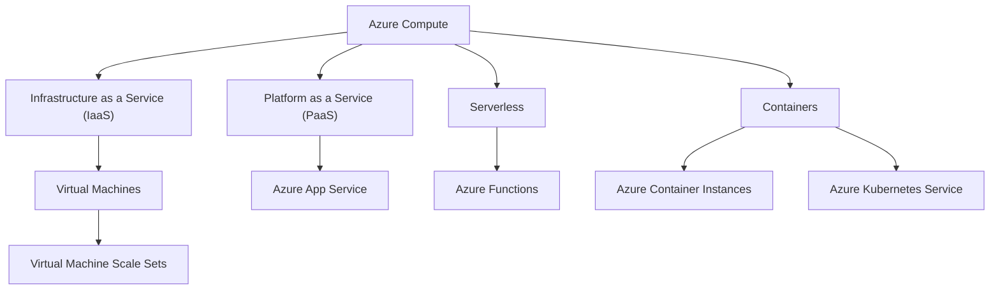

# Azure Compute Overview

```mermaid
flowchart TD

    COMPUTE["Azure Compute"]

    COMPUTE --> IAAS["Infrastructure as a Service (IaaS)"]
    COMPUTE --> PAAS["Platform as a Service (PaaS)"]
    COMPUTE --> SERVERLESS["Serverless"]

    IAAS --> VM["Virtual Machines"]
    VM --> VMSS["Virtual Machine Scale Sets"]

    PAAS --> APP["Azure App Service"]

    SERVERLESS --> FUNC["Azure Functions"]

    COMPUTE --> CONTAINERS["Containers"]

    CONTAINERS --> ACI["Azure Container Instances"]

    CONTAINERS --> AKS["Azure Kubernetes Service"]
```