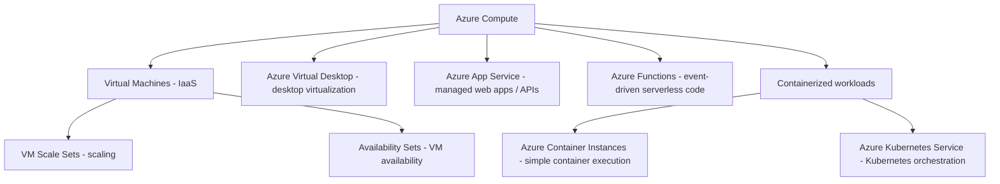

# Azure Compute Overview



## Quick Orientation

```text
Need server / OS control
→ Virtual Machine

Need scalable VM capacity
→ VM Scale Sets

Need VM fault/update separation
→ Availability Set

Need cloud-hosted Windows desktop
→ Azure Virtual Desktop

Need managed web app / API hosting
→ App Service

Need event-driven code
→ Azure Functions

Need simple container execution
→ Azure Container Instances

Need Kubernetes orchestration
→ Azure Kubernetes Service
```
