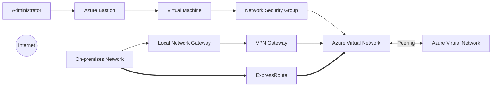

## Azure Networking Overview

```mermaid
flowchart LR

    USER[Administrator]

    INTERNET((Internet))

    ONPREM[On-premises Network]

    VNET1[Azure Virtual Network]

    VNET2[Azure Virtual Network]

    VM[Virtual Machine]

    NSG[Network Security Group]

    BASTION[Azure Bastion]

    VPN[VPN Gateway]

    ER[ExpressRoute]

    LNG[Local Network Gateway]

    USER --> BASTION

    BASTION --> VM

    VM --> NSG

    NSG --> VNET1

    VNET1 <-->|Peering| VNET2

    ONPREM --> LNG

    LNG --> VPN

    VPN --> VNET1

    ONPREM ==> ER

    ER ==> VNET1
```