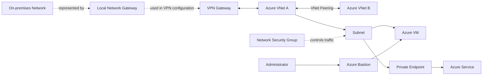

# Azure Networking Overview

This diagram provides a high-level view of how the main Azure networking components relate to each other.



## How to Read the Diagram

### Network Structure

```text
VNet
 ↓
Subnet
 ↓
Azure resources
```

A **VNet** provides the Azure network.

A **Subnet** divides the VNet into smaller network segments.

---

### Traffic Control

```text
NSG
→ controls traffic
```

An NSG is not a network hop.

It applies security rules that allow or deny network traffic.

---

### VNet-to-VNet Connectivity

```text
VNet A
   ↕
VNet B

→ VNet Peering
```

VNet Peering privately connects Azure Virtual Networks.

---

### Private Access to Azure Services

```text
VNet
 ↓
Private Endpoint
 ↓
Azure Service
```

A Private Endpoint gives a supported Azure service a private access path from the VNet.

---

### VM Administration

```text
Administrator
      ↓
Azure Bastion
      ↓
Azure VM
```

Azure Bastion provides secure RDP/SSH access without requiring a public IP on the target VM.

---

### On-Premises Connectivity

```text
On-premises
      ↕
VPN Gateway
      ↕
Azure VNet
```

A **VPN Gateway** provides the actual VPN connectivity.

The **Local Network Gateway** is different:

> It represents the remote/on-premises network in the Azure VPN configuration.

It should not be interpreted as another network hop between the on-premises environment and Azure.