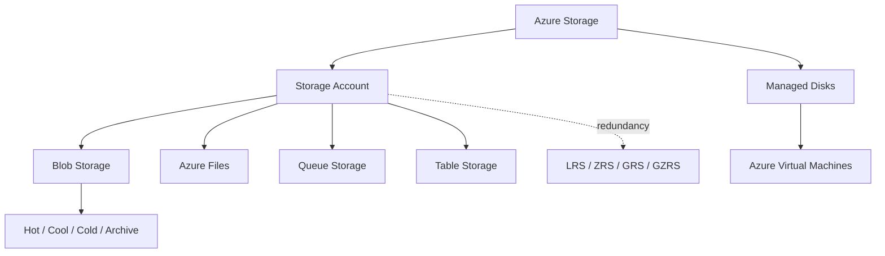

# Azure Storage Services

```mermaid
flowchart TD
    A["Azure Storage"]

    A --> SA["Storage Account"]
    A --> MD["Managed Disks"]

    SA --> B["Blob Storage"]
    SA --> F["Azure Files"]
    SA --> Q["Queue Storage"]
    SA --> T["Table Storage"]

    B --> BT["Hot / Cool / Cold / Archive"]

    SA -. "redundancy" .-> R["LRS / ZRS / GRS / GZRS"]

    MD --> VM["Azure Virtual Machines"]
```
