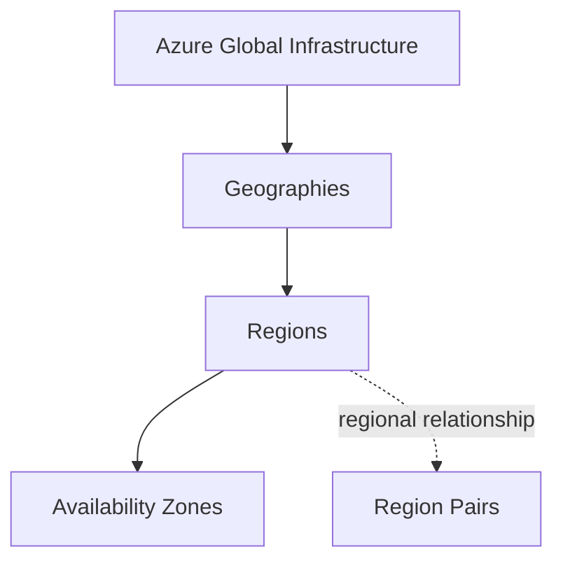

# Azure Global Infrastructure

## Definition

Azure global infrastructure is the worldwide physical and logical foundation that supports Microsoft Azure services.

It allows Azure resources and services to be deployed across different geographic locations while supporting requirements such as:

- availability
- resiliency
- performance
- data residency
- compliance

---

## Core Components

Azure global infrastructure can be understood as a hierarchy of geographic concepts:



### Geography

A **geography** is a broad market or geographic boundary that contains one or more Azure regions.

Think:

> **Broad geographic / data residency boundary**

### Region

An Azure **region** is a geographic area containing one or more datacenters connected through a low-latency network.

Think:

> **Where Azure resources are deployed**

### Availability Zone

An **Availability Zone** is a physically separate datacenter location within an Azure region.

Think:

> **Datacenter-level isolation inside a region**

### Region Pair

Azure regions can be paired with another region within the same geography.

Think:

> **Relationship between two Azure regions**

The individual topics later in this chapter explain these concepts in more detail.

---

## Why Global Infrastructure Matters

Different infrastructure levels solve different problems.

| Requirement | Think About |
|---|---|
| Geographic or data residency boundary | **Geography** |
| Where to deploy an Azure resource | **Region** |
| Protection from datacenter-level failure within a region | **Availability Zone** |
| Relationship between two Azure regions | **Region Pair** |

The important distinction is the **scope** of the requirement.

```text
Broad geographic boundary
→ Geography

Deployment location
→ Region

Datacenter isolation inside a region
→ Availability Zone

Relationship between regions
→ Region Pair
```

---

## Exam Reasoning

Do not treat Geography, Region, Availability Zone, and Region Pair as interchangeable terms.

Ask:

```text
What SCOPE is the question describing?
```

Then identify:

```text
GEOGRAPHIC / RESIDENCY BOUNDARY
→ Geography

DEPLOYMENT LOCATION
→ Region

DATACENTER-LEVEL ISOLATION
within one region
→ Availability Zone

RELATIONSHIP BETWEEN TWO REGIONS
→ Region Pair
```

> **Geography → Region → Availability Zone describes geographic scope. Region Pair describes a relationship between regions.**