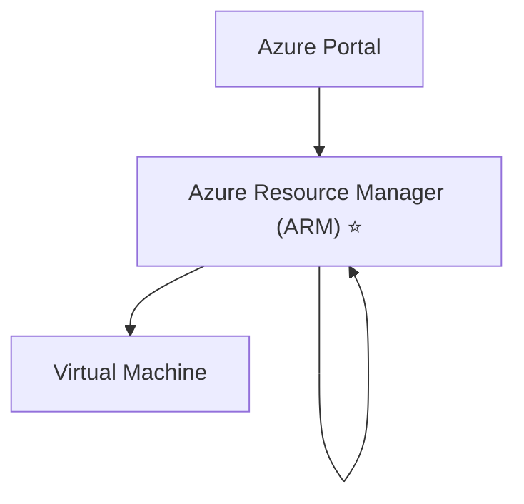

# Azure Resource Manager (ARM)

## Definition

Azure Resource Manager (ARM) is the deployment and management service for Microsoft Azure.

Every request to create, update, or delete an Azure resource passes through Azure Resource Manager.

ARM provides a consistent management layer regardless of whether resources are deployed using the Azure Portal, Azure CLI, Azure PowerShell, REST API, or Infrastructure as Code (ARM Templates or Bicep).

## Why Azure Resource Manager Exists

Azure provides hundreds of services.

Without a centralized management layer, every service would require its own deployment and management mechanism.

Azure Resource Manager provides a single, consistent interface for deploying, managing, organizing, and securing Azure resources.

## How ARM Works

Azure Resource Manager receives requests from Azure management tools and communicates with the appropriate Azure service.

For example:

The same process applies when using:

- Azure Portal
- Azure CLI
- Azure PowerShell
- Azure REST API
- ARM Templates
- Bicep

Regardless of the tool used, Azure Resource Manager performs the deployment.

## Core Capabilities

Azure Resource Manager provides:

- Resource deployment
- Resource updates
- Resource deletion
- Resource organization
- Dependency management
- Role-Based Access Control (RBAC) integration
- Azure Policy integration

## Microsoft Trigger Words

If a question contains words such as:

- deployment
- management layer
- create resources
- update resources
- delete resources
- ARM
- Azure Portal
- Azure CLI

Think:

> Azure Resource Manager

## Common Exam Questions

Microsoft frequently asks questions such as:

- What is Azure Resource Manager?
- Which Azure service manages resource deployment?
- Which management layer accepts requests from Azure tools?
- Which service deploys resources regardless of the management tool used?

## Common Mistakes

❌ Thinking Azure CLI deploys resources directly.

Azure CLI sends requests to Azure Resource Manager.

❌ Thinking Azure Portal deploys resources directly.

Azure Portal is only one of several management tools.

Azure Resource Manager performs the actual deployment.

❌ Thinking ARM Templates replace Azure Resource Manager.

ARM Templates are deployment definitions.

Azure Resource Manager performs the deployment.

## Compare With

| Azure Resource Manager | Azure Portal |
|------------------------|--------------|
| Deployment and management service | Web-based management interface |
| Processes deployment requests | Sends requests to ARM |
| Used by all Azure management tools | One management tool |

## Exam Tip

Microsoft often hides the answer by mentioning a management tool.

Examples include:

- Azure Portal
- Azure CLI
- Azure PowerShell
- ARM Templates

All of these tools send deployment requests to:

> **Azure Resource Manager (ARM)**

If the question contains the phrase:

> **deployment and management service**

the correct answer is almost always:

> **Azure Resource Manager**