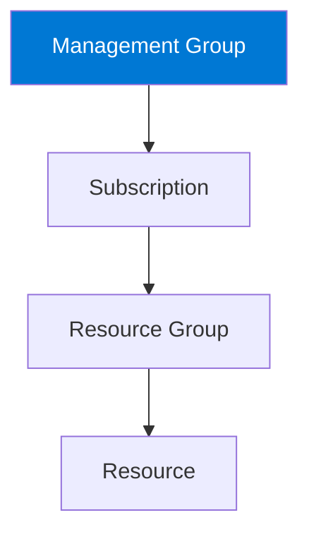

# Management Groups

## Definition

Management Groups are containers that help organizations manage multiple Azure subscriptions.

They provide a hierarchical structure above Azure subscriptions, allowing governance policies and access permissions to be applied consistently across multiple subscriptions.

## Why Management Groups Exist

Large organizations often use multiple Azure subscriptions.

Examples include:

- Production
- Development
- Testing
- Different business units
- Different departments

Managing each subscription individually would be difficult and error-prone.

Management Groups provide a centralized way to organize subscriptions and apply governance at scale.

## Azure Resource Hierarchy

Management Groups are the highest level in the Azure resource hierarchy.

Policies and permissions assigned at a higher level can be inherited by lower levels.

## Common Use Cases

Management Groups are commonly used to:

- Organize multiple subscriptions.
- Apply Azure Policy across many subscriptions.
- Apply Azure RBAC assignments consistently.
- Separate environments or business units.
- Simplify governance for large organizations.

## Microsoft Trigger Words

If a question contains words such as:

- multiple subscriptions
- hierarchy
- governance
- organize subscriptions
- apply policies across subscriptions
- central management

Think:

> Management Groups

## Common Exam Questions

Microsoft frequently asks questions such as:

- Which Azure component organizes multiple subscriptions?
- Where should governance be applied across many subscriptions?
- Which Azure service sits above subscriptions?

## Common Mistakes

❌ Thinking Management Groups contain resources.

Management Groups contain **subscriptions**, not Azure resources.

❌ Thinking Azure Policy replaces Management Groups.

Management Groups provide the scope.

Azure Policy provides the rules.

These services work together.

## Compare With

| Management Groups | Resource Groups |
|-------------------|-----------------|
| Organize subscriptions | Organize resources |
| Highest logical level | Inside a subscription |
| Governance across subscriptions | Resource organization |

## Exam Tip

One of Microsoft's favorite questions is:

> "A company has multiple Azure subscriptions and wants to apply the same Azure Policy to all of them."

Correct thinking:

- **Where** is the policy applied?

→ **Management Group**

- **What** enforces the rule?

→ **Azure Policy**

Always separate the **scope** from the **rule**.