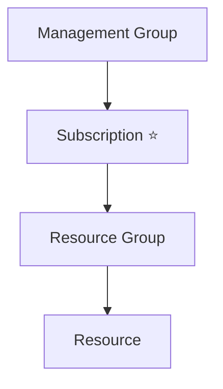

# Subscriptions

## Definition

An Azure Subscription is a logical container that provides access to Azure services.

It acts as the primary boundary for:

- Billing
- Resource deployment
- Quotas
- Governance

Every Azure resource belongs to exactly one subscription.

## Why Subscriptions Exist

Organizations often separate Azure resources into multiple subscriptions to simplify management and cost tracking.

Common examples include:

- Production
- Development
- Testing
- Different departments
- Different customers

Using multiple subscriptions provides better administrative control and financial separation.

## Key Characteristics

An Azure Subscription:

- Contains one or more Resource Groups.
- Is associated with a billing account.
- Defines quotas and service limits.
- Is the primary billing boundary in Azure.

Multiple subscriptions can belong to the same Management Group.

## Azure Resource Hierarchy

A subscription sits between Management Groups and Resource Groups.

## Billing Boundary

One of the primary purposes of a subscription is cost management.

By default:

- Billing reports are generated per subscription.
- Azure invoices are generated per subscription.
- Budgets can be configured per subscription.

## Microsoft Trigger Words

If a question contains words such as:

- billing
- invoice
- quota
- subscription
- billing boundary
- multiple subscriptions

Think:

> Azure Subscription

## Common Exam Questions

Microsoft frequently asks questions such as:

- Which Azure component generates separate invoices?
- Which Azure component acts as the billing boundary?
- Where are Azure resources deployed?
- Which Azure component contains Resource Groups?

## Common Mistakes

❌ Thinking a Subscription organizes Azure resources.

Resource Groups organize resources.

Subscriptions organize billing, governance, and quotas.

❌ Thinking billing is performed per Resource Group.

Billing reports and invoices are generated per Subscription.

## Compare With

| Subscription | Resource Group |
|--------------|----------------|
| Billing boundary | Logical resource container |
| Contains Resource Groups | Contains Resources |
| Defines quotas | Organizes related resources |

## Exam Tip

Microsoft often hides the word **billing** inside longer scenarios.

Examples include:

- separate invoice
- separate billing reports
- different cost tracking
- billing boundary

When you see these phrases, the correct answer is usually:

> **Azure Subscription**