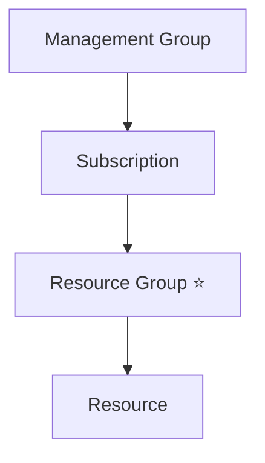

# Resource Groups

## Definition

A Resource Group is a logical container used to organize and manage related Azure resources.

Every Azure resource must belong to exactly one Resource Group.

A Resource Group does not own the resources inside it—it simply provides a way to organize and manage them together.

## Why Resource Groups Exist

Applications often consist of multiple Azure resources.

For example, a web application might include:

- Virtual Machine
- Storage Account
- SQL Database
- Virtual Network
- Network Security Group

Instead of managing each resource individually, Azure groups related resources into a single Resource Group.

This simplifies deployment, management, monitoring, and deletion.

## Key Characteristics

A Resource Group:

- Is a logical container.
- Exists inside a Subscription.
- Can contain different Azure resource types.
- Can contain resources located in different Azure Regions.
- Is used to organize resources that share the same lifecycle.

## Azure Resource Hierarchy

A Resource Group is the level where related Azure resources are organized.

## Typical Use Cases

Organizations commonly use Resource Groups to separate:

- Applications
- Environments (Development, Test, Production)
- Projects
- Teams

Resources that are created, updated, and removed together are typically placed in the same Resource Group.

## Microsoft Trigger Words

If a question contains words such as:

- logical container
- organize resources
- related resources
- manage together
- delete together

Think:

> Resource Group

## Common Exam Questions

Microsoft frequently asks questions such as:

- What is a Resource Group?
- Which Azure component is a logical container for resources?
- Which Azure component contains Virtual Machines, Storage Accounts, and Databases?
- Where should related Azure resources be organized?

## Common Mistakes

❌ Thinking a Resource Group is a physical location.

A Resource Group is a logical container.

Resources inside the Resource Group can exist in different Azure Regions.

❌ Thinking a Resource Group is the billing boundary.

Subscriptions are the billing boundary.

Resource Groups organize resources.

❌ Thinking a Resource Group contains Subscriptions.

Subscriptions contain Resource Groups.

## Compare With

| Resource Group | Subscription |
|----------------|--------------|
| Logical container | Billing boundary |
| Contains Azure Resources | Contains Resource Groups |
| Organizes related resources | Defines quotas and billing |

## Exam Tip

Ask:

> "Do these resources belong together and share a lifecycle?"

If yes:

→ **Resource Group**

Remember:

- Resource Group → organizes related resources.
- Subscription → broader billing, quota, and governance scope.
- Management Group → organizes multiple subscriptions.

Resources in the same Resource Group can be located in different Azure Regions.