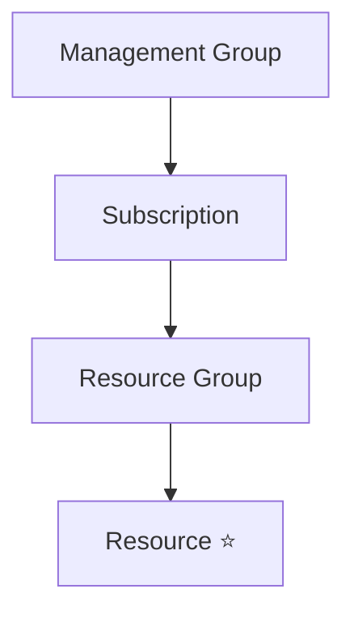

# Azure Resources

## Definition

An Azure Resource is an individual instance of a service that is created and managed in Azure.

Every Azure service you deploy becomes an Azure Resource.

Examples include:

- Virtual Machine
- Storage Account
- SQL Database
- Virtual Network
- Azure Key Vault
- App Service

Resources are the lowest level in the Azure resource hierarchy.

## Why Resources Exist

Azure provides hundreds of cloud services.

When you create one of these services, Azure creates a resource that represents that service within your subscription.

Resources are the building blocks of every Azure solution.

## Azure Resource Hierarchy

Every resource:

- belongs to one Resource Group;
- belongs to one Subscription;
- is deployed into one Azure Region.

## Resource Types

Azure resources represent different categories of cloud services.

Common examples include:

| Resource | Purpose |
|----------|---------|
| Virtual Machine | Compute |
| Storage Account | Storage |
| SQL Database | Database |
| Virtual Network | Networking |
| Azure Key Vault | Secrets and certificates |
| App Service | Web applications |

## Resource Lifecycle

Resources can be:

- Created
- Updated
- Monitored
- Stopped (where applicable)
- Deleted

Azure Resource Manager (ARM) manages these operations.

## Microsoft Trigger Words

If a question contains words such as:

- deploy resource
- Azure service
- create resource
- Storage Account
- Virtual Machine
- SQL Database

Think:

> Azure Resource

## Common Exam Questions

Microsoft frequently asks questions such as:

- What is an Azure Resource?
- Which Azure component represents a deployed service?
- What is created inside a Resource Group?
- What is the lowest level in the Azure resource hierarchy?

## Common Mistakes

❌ Thinking Resource Groups contain subscriptions.

Subscriptions contain Resource Groups.

❌ Thinking Resources can exist without a Resource Group.

Every Azure resource must belong to exactly one Resource Group.

❌ Thinking Resources are the same as Azure services.

Azure services are the capabilities provided by Azure.

Resources are the deployed instances of those services.

## Compare With

| Azure Resource | Resource Group |
|----------------|----------------|
| Individual Azure service instance | Logical container |
| Represents one deployed service | Organizes multiple resources |
| Lowest level in the hierarchy | One level above resources |

## Exam Tip

Microsoft often hides the answer by naming a specific Azure service.

For example:

- Virtual Machine
- Storage Account
- SQL Database
- App Service

These are all examples of **Azure Resources**.

When the question asks:

> "What is being deployed?"

the correct concept is usually:

> **Azure Resource**