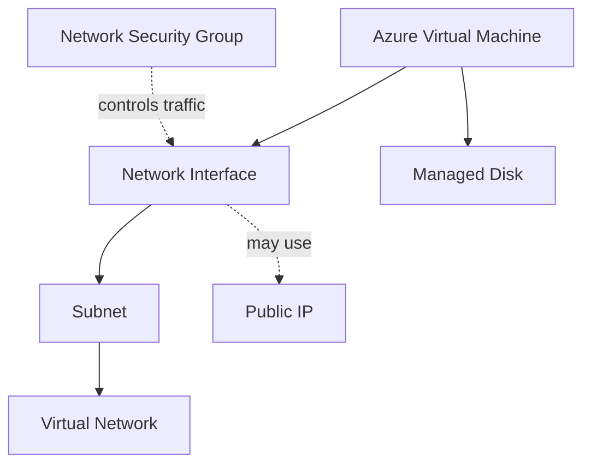

# Virtual Machine Supporting Resources

## Definition

An Azure Virtual Machine does not operate as an isolated resource.

A typical VM deployment uses several Azure resources that provide storage, networking, addressing, and traffic control.

## What Problem Does It Solve?

Understanding the resources associated with a VM helps identify which Azure component provides a specific capability.

A typical VM environment may include:



## Key Resources

### Managed Disk

Provides persistent block storage for the VM.

Think:

> **VM storage → Managed Disk**

---

### Network Interface — NIC

Connects the VM to an Azure virtual network.

Think:

> **VM network connection → Network Interface**

---

### Virtual Network — VNet

Provides the private Azure network environment.

---

### Subnet

Provides the IP address range within the VNet to which the VM's network interface is connected.

---

### Public IP Address

Can provide public addressing when direct public connectivity is required.

A VM does **not** always require a public IP address.

---

### Network Security Group — NSG

Controls allowed and denied inbound and outbound traffic.

An NSG does not create connectivity.

It controls traffic associated with a network interface or subnet.

## Decision Factors

Ask what capability the scenario requires.

```text
Persistent VM storage
→ Managed Disk

Connect VM to network
→ Network Interface

Private Azure network
→ VNet

Network segment
→ Subnet

Public addressing
→ Public IP

Traffic filtering
→ NSG
```

## Best-Fit Scenarios

### Scenario 1

A VM requires persistent operating system and application storage.

→ **Managed Disk**

### Scenario 2

A VM must communicate with resources in an Azure VNet.

→ **Network Interface connected to a subnet**

### Scenario 3

Inbound traffic to a VM must be restricted by port and protocol.

→ **NSG**

## Common Mistakes

### NSG vs Network Interface

```text
Connect VM to network
→ Network Interface

Control VM network traffic
→ NSG
```

### Public IP

Do not assume every VM requires a public IP.

Private connectivity or services such as Azure Bastion can allow scenarios where the target VM does not need one.

### Disk vs Storage Account

For AZ-900 VM scenarios, think:

> **VM block storage → Managed Disks**

## Exam Reasoning

Do not memorize a VM as a single box.

Think of the VM as a compute resource surrounded by supporting resources:

```text
COMPUTE
→ Virtual Machine

STORAGE
→ Managed Disk

NETWORK CONNECTION
→ Network Interface

NETWORK
→ VNet / Subnet

TRAFFIC CONTROL
→ NSG

PUBLIC ADDRESSING
→ Public IP when required
```