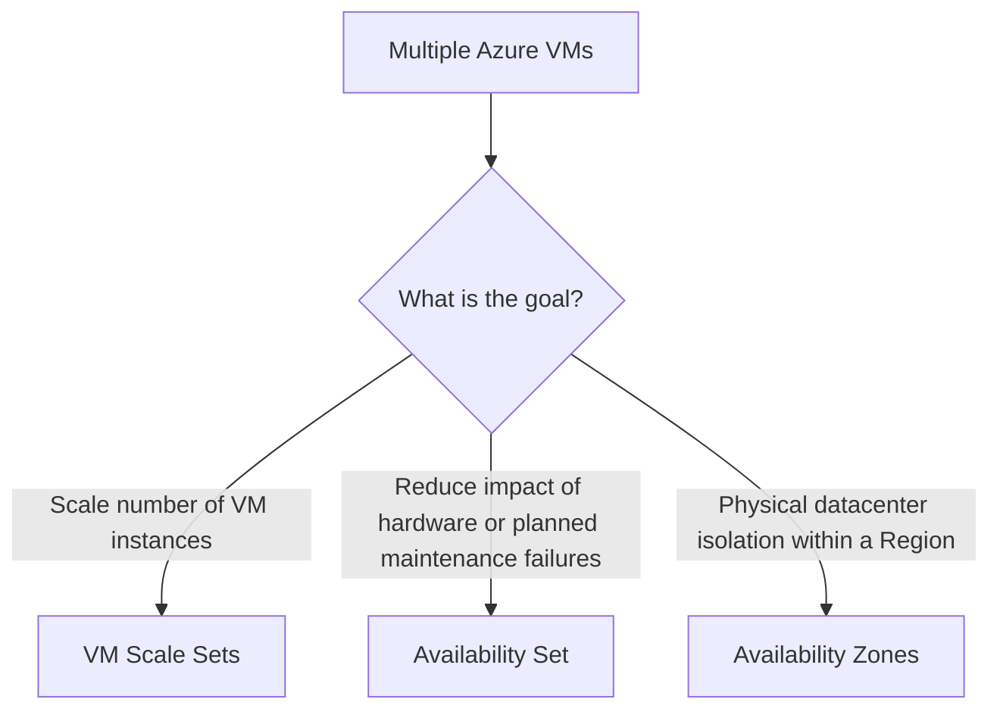

# Availability Sets

## Definition

An Availability Set is a logical grouping of Azure Virtual Machines designed to improve VM availability.

It distributes VMs across **fault domains** and **update domains**.

## What Problem Does It Solve?

If multiple VMs supporting the same workload are affected by the same hardware failure or planned maintenance event, the application may become unavailable.

Availability Sets reduce this risk by separating VM instances.

## Key Characteristics

### Fault Domains

Fault domains separate VMs across groups that do not share the same underlying power and network infrastructure.

Think:

> **Hardware / power / network failure → Fault Domain**

### Update Domains

Update domains separate VMs into groups that can undergo planned maintenance at different times.

Think:

> **Planned maintenance → Update Domain**

## Decision Factors

The important question is:

> **Is the requirement about scaling or availability?**



## Compare With

| Requirement | Best fit |
|---|---|
| Scale multiple VM instances | **VM Scale Sets** |
| Fault/update separation for VMs | **Availability Set** |
| Datacenter-level isolation | **Availability Zone** |

## Common Mistakes

### Availability Set vs VM Scale Set

```text
Availability
→ Availability Set

Scaling
→ VM Scale Sets
```

Do not choose VM Scale Sets merely because the scenario mentions multiple VMs.

Determine **why** multiple VMs are required.

### Availability Set vs Availability Zone

An Availability Set uses logical fault and update separation.

An Availability Zone provides physical datacenter-level isolation within an Azure Region.

## Exam Reasoning

Ask:

```text
Is the problem SCALE?
→ VM Scale Sets

Is the problem VM fault/update separation?
→ Availability Set

Is the problem datacenter isolation?
→ Availability Zone
```

> **Scale and availability are different requirements.**