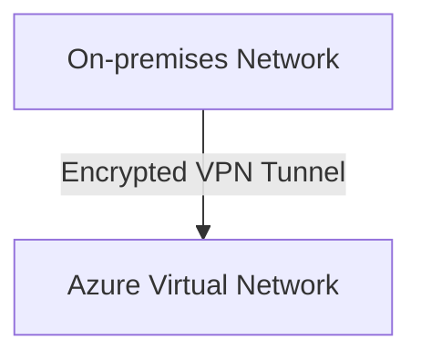
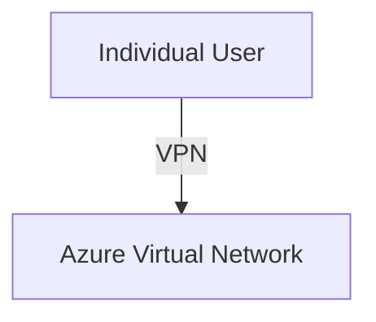
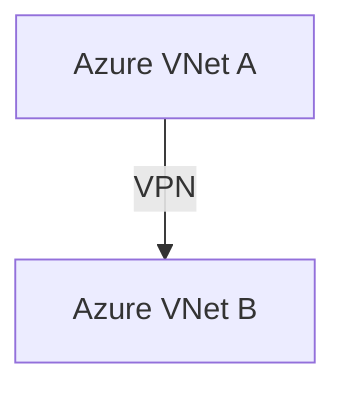

# Azure VPN Gateway

## Definition

Azure VPN Gateway is an Azure networking service that provides secure communication between an on-premises network and an Azure Virtual Network over the public Internet.

It creates encrypted VPN tunnels to protect data while it is transmitted between locations.

## Why Azure VPN Gateway Exists

Many organizations already have existing on-premises infrastructure.

Examples include:

- Corporate datacenters
- Office networks
- Branch offices

These environments often need secure connectivity to Azure without requiring a dedicated private connection.

Azure VPN Gateway provides encrypted communication over the Internet.

## Characteristics

Azure VPN Gateway provides:

- Encrypted VPN tunnels
- Secure communication over the public Internet
- Hybrid cloud connectivity
- Site-to-Site (S2S) VPN
- Point-to-Site (P2S) VPN
- VNet-to-VNet connectivity

## VPN Connection Types

### Site-to-Site (S2S)

Connects:

Used for permanent connectivity between an organization and Azure.

### Point-to-Site (P2S)

Connects:

Used when individual users need secure remote access.

### VNet-to-VNet

Connects:

Although possible, Microsoft generally expects **Virtual Network Peering** as the preferred answer for Azure-to-Azure connectivity in AZ-900 unless VPN is explicitly mentioned.

## Local Network Gateway

When configuring a Site-to-Site VPN, Azure represents the on-premises network by using a **Local Network Gateway**.

This object stores information about the on-premises VPN device and address space.

## Typical Use Cases

Azure VPN Gateway is commonly used for:

- Hybrid cloud environments
- Secure office-to-Azure connectivity
- Remote user access
- Secure branch office connectivity

## Microsoft Trigger Words

If a question contains words such as:

- encrypted tunnel
- Site-to-Site VPN
- Point-to-Site VPN
- on-premises
- Internet
- secure connection

Think:

> Azure VPN Gateway

## Common Exam Questions

Microsoft frequently asks questions such as:

- Which Azure service creates an encrypted tunnel over the Internet?
- Which Azure service connects an on-premises network to Azure?
- Which Azure object represents the on-premises network in a Site-to-Site VPN?
- Which Azure service supports Point-to-Site VPN?

## Common Mistakes

❌ Thinking ExpressRoute uses the public Internet.

ExpressRoute uses a dedicated private connection.

VPN Gateway uses the public Internet.

❌ Thinking Virtual Network Peering connects on-premises networks.

VNet Peering connects Azure Virtual Networks.

VPN Gateway connects Azure with on-premises environments.

## Compare With

| Azure VPN Gateway | ExpressRoute |
|-------------------|--------------|
| Uses the public Internet | Uses a private dedicated connection |
| Encrypted VPN tunnel | Dedicated private circuit |
| Lower cost | Higher cost |
| Faster deployment | Requires connectivity provider |

## Exam Tip

Microsoft almost always uses one of these phrases:

- encrypted tunnel
- Site-to-Site VPN
- Point-to-Site VPN
- over the Internet
- on-premises

These phrases almost always indicate:

> **Azure VPN Gateway**

If the question says:

- private dedicated connection
- no public Internet

the correct answer is usually:

> **ExpressRoute**