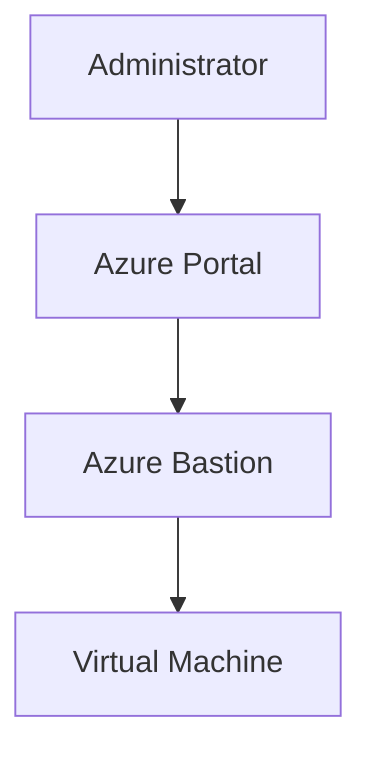

# Azure Bastion

## Definition

Azure Bastion is a fully managed Azure service that provides secure RDP and SSH connectivity to Azure Virtual Machines by using the VMs' private IP addresses.

Users can connect through the Azure portal, and supported Bastion configurations also allow native RDP or SSH client connections.

The target Virtual Machines do not require public IP addresses for Bastion connectivity.

## Why Azure Bastion Exists

Administrators need secure access to Virtual Machines for management and maintenance.

Traditionally, this required:

- Public IP addresses
- Open RDP (3389) ports
- Open SSH (22) ports

Exposing these services to the Internet increases the attack surface.

Azure Bastion provides secure management access without exposing Virtual Machines directly to the Internet.

## Characteristics

Azure Bastion provides:

- Secure RDP connectivity
- Secure SSH connectivity
- Connectivity to VMs through private IP addresses
- Browser-based access through the Azure portal
- Native client support in supported configurations
- No public IP required on the target VM
- Fully managed service

## Typical Use Cases

Azure Bastion is commonly used for:

- Managing Windows Virtual Machines
- Managing Linux Virtual Machines
- Secure administrative access
- Production environments
- Organizations with strict security requirements

## How Azure Bastion Works

Instead of connecting directly to a Virtual Machine, administrators connect to Azure Bastion through the Azure portal.

Azure Bastion then securely establishes the RDP or SSH session to the target Virtual Machine inside the Virtual Network.

## Microsoft Trigger Words

If a question contains words such as:

- secure RDP
- secure SSH
- VM administration
- private IP
- no public IP on the VM
- Bastion

Think:

> Azure Bastion

## Common Exam Questions

Microsoft frequently asks questions such as:

- Which Azure service provides secure RDP access?
- Which Azure service provides secure SSH access?
- Which Azure service allows administrators to connect to Virtual Machines through the Azure portal?
- Which Azure service removes the need for public IP addresses on Virtual Machines?

## Common Mistakes

❌ Thinking Azure Bastion connects networks.

Azure Bastion provides administrative access to Virtual Machines.

It does not connect Virtual Networks.

❌ Thinking Azure Bastion replaces VPN Gateway.

VPN Gateway connects networks.

Azure Bastion provides secure management access to Virtual Machines.

## Compare With

| Azure Bastion | Azure VPN Gateway |
|---------------|-------------------|
| Secure VM administration | Connects networks |
| RDP and SSH | Site-to-Site / Point-to-Site VPN |
| Browser-based access | Encrypted VPN tunnel |
| No public IP on VM required | Connects Azure with on-premises networks |

## Exam Tip

Ask:

> "Is the requirement about connecting networks or securely administering a Virtual Machine?"

Secure RDP or SSH access to a VM:

→ **Azure Bastion**

Connect networks:

→ Think about **VPN Gateway, ExpressRoute, or VNet Peering**

Remember:

> **Bastion = secure VM administration, not network-to-network connectivity**