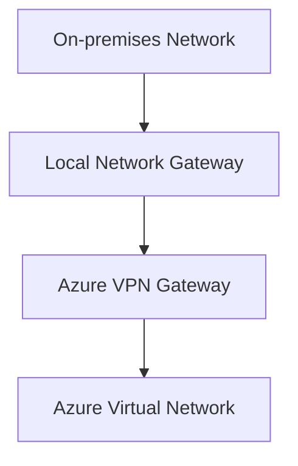

# Local Network Gateway

## Definition

A Local Network Gateway is an Azure resource that represents an on-premises network when configuring a Site-to-Site (S2S) VPN connection.

It stores information about the on-premises VPN device and the address spaces of the local network.

A Local Network Gateway does **not** provide network connectivity by itself. Instead, it is used together with an Azure VPN Gateway.

## Why Local Network Gateway Exists

When Azure establishes a Site-to-Site VPN connection, it must know where the remote network is located.

The Local Network Gateway provides Azure with information about:

- The public IP address of the on-premises VPN device.
- The address space of the on-premises network.

This information allows Azure VPN Gateway to establish a secure VPN tunnel.

## Characteristics

A Local Network Gateway:

- Represents an on-premises network.
- Stores the public IP address of the VPN device.
- Stores the address space of the local network.
- Is used only for VPN connectivity scenarios.
- Works together with Azure VPN Gateway.

## Typical Use Cases

Local Network Gateway is commonly used for:

- Site-to-Site VPN deployments.
- Hybrid cloud networking.
- Connecting corporate datacenters to Azure.
- Branch office connectivity.

## Relationship with Azure VPN Gateway

When configuring a Site-to-Site VPN, two Azure resources work together:

The Local Network Gateway describes the on-premises network.

The Azure VPN Gateway establishes the encrypted VPN connection.

## Microsoft Trigger Words

If a question contains words such as:

- represents the on-premises network
- Site-to-Site VPN
- on-premises VPN device
- local network
- address space

Think:

> Local Network Gateway

## Common Exam Questions

Microsoft frequently asks questions such as:

- Which Azure object represents the on-premises network?
- Which Azure resource stores the on-premises VPN device information?
- Which Azure object is required for a Site-to-Site VPN?

## Common Mistakes

❌ Thinking Local Network Gateway creates the VPN tunnel.

The VPN tunnel is created by **Azure VPN Gateway**.

❌ Thinking Local Network Gateway connects Azure Virtual Networks.

Virtual Network Peering connects Azure Virtual Networks.

Local Network Gateway represents an on-premises network.

## Compare With

| Local Network Gateway | Azure VPN Gateway |
|-----------------------|-------------------|
| Represents the on-premises network | Creates the VPN connection |
| Stores VPN device information | Establishes encrypted tunnels |
| Configuration object | Connectivity service |

## Exam Tip

Microsoft usually asks this concept using one specific question:

> Which Azure object represents the on-premises network in a Site-to-Site VPN?

The correct answer is:

> **Local Network Gateway**

Remember:

- **Local Network Gateway** → Represents the on-premises network.
- **Azure VPN Gateway** → Creates the secure VPN connection.