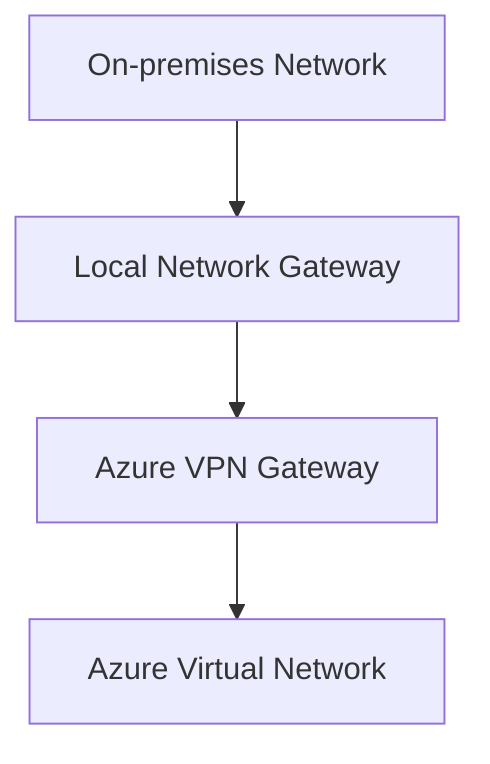

# Local Network Gateway

## Definition

A Local Network Gateway is an Azure resource that represents a remote network, typically an on-premises site, when configuring Site-to-Site VPN connectivity.

It stores information such as:

- the IP address or FQDN of the remote VPN device;
- the address prefixes of the remote network;
- optional BGP configuration.

A Local Network Gateway does not create connectivity by itself. It is used as part of a VPN Gateway connection.

## Why Local Network Gateway Exists

When Azure establishes a Site-to-Site VPN connection, it must know where the remote network is located.

The Local Network Gateway provides Azure with information about:

- The public IP address of the on-premises VPN device.
- The address space of the on-premises network.

This information allows Azure VPN Gateway to establish a secure VPN tunnel.

## Characteristics

A Local Network Gateway:

- Represents a remote network or VPN site
- Stores the remote VPN endpoint information
- Stores remote network address prefixes
- Can include BGP configuration
- Works with Azure VPN Gateway connections

## Typical Use Cases

Local Network Gateway is commonly used for:

- Site-to-Site VPN deployments.
- Hybrid cloud networking.
- Connecting corporate datacenters to Azure.
- Branch office connectivity.

## Relationship with Azure VPN Gateway

When configuring a Site-to-Site VPN, two Azure resources work together:

The Local Network Gateway describes the on-premises network.

The Azure VPN Gateway establishes the encrypted VPN connection.

## Microsoft Trigger Words

If a question contains words such as:

- represents the on-premises network
- Site-to-Site VPN
- on-premises VPN device
- local network
- address space

Think:

> Local Network Gateway

## Common Exam Questions

Microsoft frequently asks questions such as:

- Which Azure object represents the on-premises network?
- Which Azure resource stores the on-premises VPN device information?
- Which Azure object is required for a Site-to-Site VPN?

## Common Mistakes

❌ Thinking Local Network Gateway creates the VPN tunnel.

The VPN tunnel is created by **Azure VPN Gateway**.

❌ Thinking Local Network Gateway connects Azure Virtual Networks.

Virtual Network Peering connects Azure Virtual Networks.

Local Network Gateway represents an on-premises network.

## Compare With

| Local Network Gateway | Azure VPN Gateway |
|-----------------------|-------------------|
| Represents the on-premises network | Creates the VPN connection |
| Stores VPN device information | Establishes encrypted tunnels |
| Configuration object | Connectivity service |

## Exam Tip

Separate the two objects:

**Local Network Gateway**

→ Describes the remote/on-premises side.

**Azure VPN Gateway**

→ Terminates and handles the Azure VPN connectivity.

If the question asks:

> "Which Azure object represents the on-premises site?"

think:

> **Local Network Gateway**