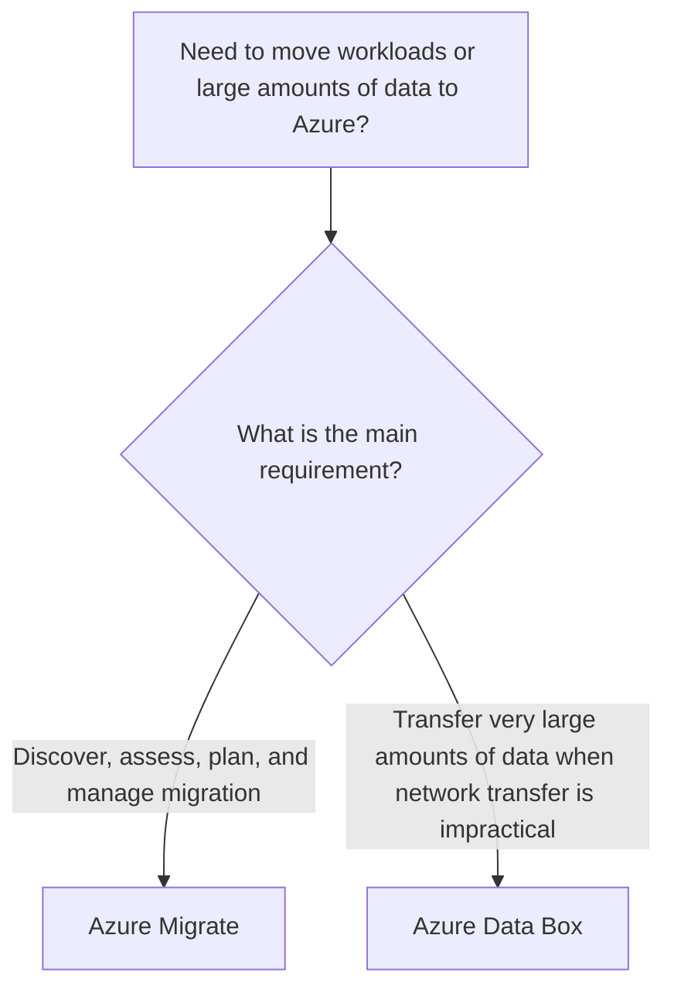

# Data Migration

## Definition

Azure provides services for planning migrations and for transferring large volumes of data to Azure.

For AZ-900, two important services are:

- Azure Migrate
- Azure Data Box

## Azure Migrate

Azure Migrate provides a centralized service for discovering, assessing, planning, and tracking migration of on-premises workloads to Azure.

Think:

> **Assess / plan / manage migration → Azure Migrate**

## Azure Data Box

Azure Data Box uses a physical device to transfer large amounts of data when network-based transfer is impractical, too slow, or unavailable.

Think:

> **Very large data + limited network → Azure Data Box**

## Decision Factors

First identify **what kind of migration problem must be solved**.



## Azure Migrate vs Azure Data Box

| Decision Factor | Azure Migrate | Azure Data Box |
|---|---|---|
| Primary purpose | Migration assessment and management | Large-scale physical data transfer |
| Focus | Workloads, servers, apps, and databases | Data |
| Discovery and assessment | Yes | No |
| Physical device | No | Yes |
| Useful when network transfer is impractical | Not its primary purpose | Yes |
| Best-fit question | "How should we assess and manage the migration?" | "How should we move this very large dataset?" |

> For file-level transfer and synchronization tools such as **AzCopy, Storage Explorer, and Azure File Sync**, see [File Movement Tools](9-file-movement-tools.md).

## Common Mistakes

Azure Migrate is not a physical transfer device. It is a migration assessment and management service.

Azure Data Box is not the default choice for ordinary file transfers. It is useful when the data volume and network constraints make online transfer impractical.

## Microsoft Trigger Words

```text
Assess / discover / migration hub
→ Azure Migrate

Physical device / very large dataset / limited network
→ Azure Data Box
```

## Exam Reasoning

First classify the migration task:

```text
MIGRATION ASSESSMENT / PLANNING / MANAGEMENT
→ Azure Migrate

VERY LARGE DATA + NETWORK TRANSFER IS IMPRACTICAL
→ Azure Data Box
```

If the task is instead about command-line copy, GUI storage management, or ongoing Windows file-server synchronization, use the tools covered in [File Movement Tools](9-file-movement-tools.md).
