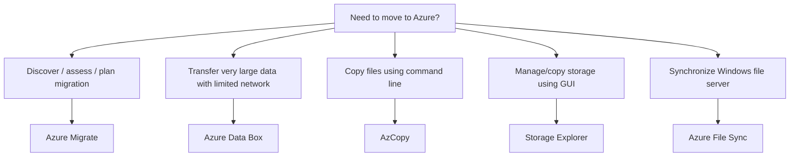

# Data Migration

## Definition

Azure provides services for planning migrations and for transferring large volumes of data to Azure.

For AZ-900, two important services are:

- Azure Migrate
- Azure Data Box

## Azure Migrate

Azure Migrate provides a centralized service for discovering, assessing, planning, and tracking migration of on-premises workloads to Azure.

Think:

> **Assess / plan / manage migration → Azure Migrate**

## Azure Data Box

Azure Data Box uses a physical device to transfer large amounts of data when network-based transfer is impractical, too slow, or unavailable.

Think:

> **Very large data + limited network → Azure Data Box**

## Decision Factors

Ask what problem must be solved:



## Compare With

| Requirement | Best Fit |
|---|---|
| Discover, assess, plan, and track migration | Azure Migrate |
| Large offline/physical data transfer | Azure Data Box |
| Command-line file transfer | AzCopy |
| GUI storage management | Storage Explorer |
| Ongoing Windows file-server synchronization | Azure File Sync |

## Common Mistakes

Azure Migrate is not a physical transfer device. It is a migration assessment and management service.

Azure Data Box is not the default choice for ordinary file transfers. It is useful when the data volume and network constraints make online transfer impractical.

## Microsoft Trigger Words

```text
Assess / discover / migration hub
→ Azure Migrate

Physical device / very large dataset / limited network
→ Azure Data Box
```

## Exam Reasoning

First classify the task:

```text
MIGRATION PLANNING
→ Azure Migrate

LARGE PHYSICAL DATA TRANSFER
→ Azure Data Box

FILE-LEVEL MOVEMENT OR SYNC
→ AzCopy / Storage Explorer / Azure File Sync
```
