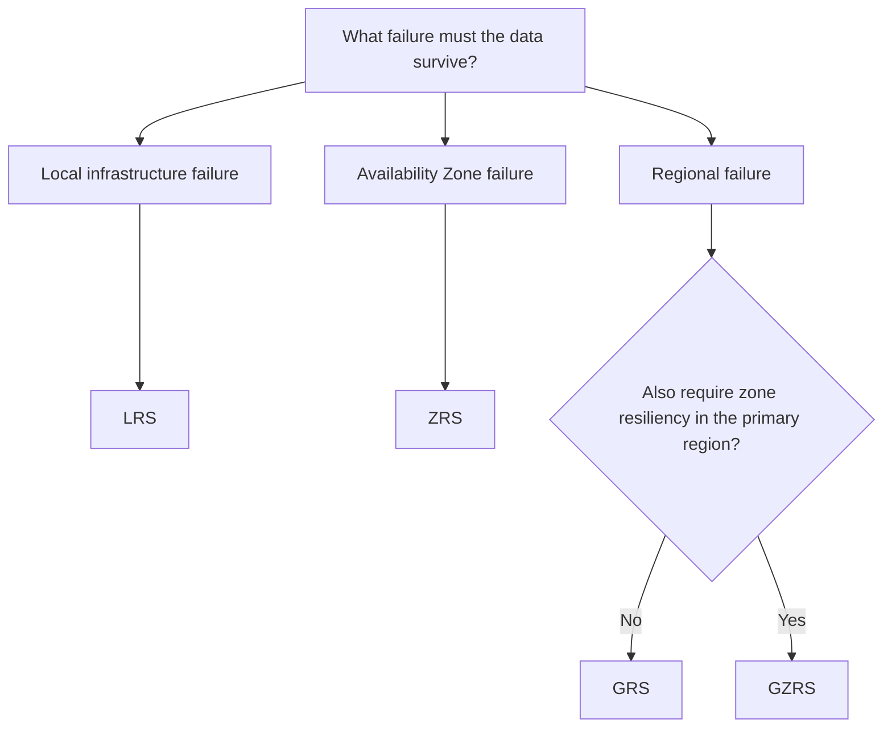

# Storage Redundancy

## Definition

Azure Storage redundancy keeps multiple copies of data to protect against infrastructure failures.

The redundancy option determines **where the copies are stored** and therefore which failures the storage design can tolerate.

## What Problem Does It Solve?

Different workloads require different levels of resiliency.

The correct redundancy option balances:

- required availability and durability
- protection against zone or regional failures
- cost

## Key Options

### Locally Redundant Storage — LRS

LRS keeps multiple copies of data within a single physical location in the primary Azure region.

Best fit when local infrastructure protection is sufficient and lower cost is important.

### Zone-Redundant Storage — ZRS

ZRS replicates data synchronously across availability zones in the primary region.

Best fit when the data must remain resilient to an availability-zone failure.

### Geo-Redundant Storage — GRS

GRS keeps copies in the primary region and asynchronously replicates data to a secondary Azure region.

Best fit when protection from a regional failure is required.

### Geo-Zone-Redundant Storage — GZRS

GZRS combines zone redundancy in the primary region with asynchronous replication to a secondary region.

Best fit when both zone resiliency in the primary region and geo-redundancy are required.

## Decision Factors

Ask:

> **What failure must the data survive?**



## Compare With

| Option | Primary Protection | Secondary Region | Relative Cost |
|---|---|---|---|
| LRS | Local infrastructure | No | Lowest |
| ZRS | Availability zones | No | Higher than LRS |
| GRS | Local + regional replication | Yes | Higher |
| GZRS | Zones + regional replication | Yes | Highest of these options |

## Common Mistakes

Do not choose the most resilient option automatically.

If the scenario only requires local protection and prioritizes cost, geo-redundancy may be unnecessary.

Do not confuse:

```text
Z = Zone
G = Geo / secondary region
```

## Microsoft Trigger Words

- local redundancy
- zone failure
- availability zones
- regional failure
- geo-redundancy
- secondary region

## Exam Reasoning

Use the minimum redundancy level that satisfies **all stated resiliency requirements**.

```text
Local protection only
→ LRS

Zone failure protection
→ ZRS

Regional failure protection
→ GRS

Zone + regional protection
→ GZRS
```

> **Required resiliency first; cost breaks the tie between valid options.**
