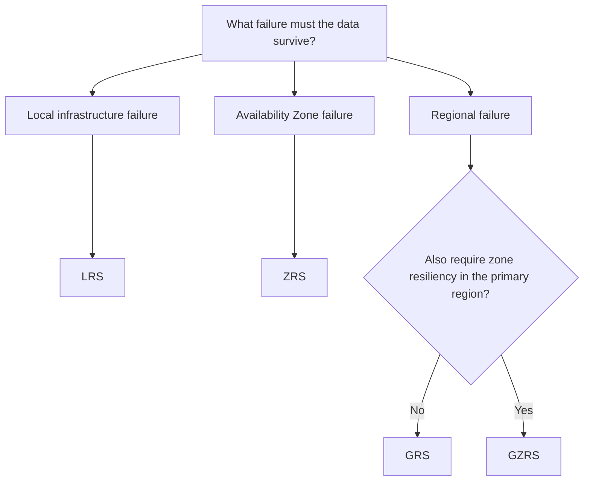

# Storage Redundancy

## Definition

Azure Storage redundancy keeps multiple copies of data to protect against infrastructure failures.

The redundancy option determines **where the copies are stored** and which failures the storage design can tolerate.

The correct choice balances:

- required resiliency
- protection against zone or regional failures
- cost

## Redundancy Comparison

| Option | Primary Protection | Secondary Region | Relative Cost |
|---|---|---|---|
| **LRS** | Local infrastructure | No | Lowest |
| **ZRS** | Availability zones | No | Higher than LRS |
| **GRS** | Local + regional replication | Yes | Higher |
| **GZRS** | Zones + regional replication | Yes | Highest of these options |

### Mental Model

```text
LRS
→ local protection

ZRS
→ zone protection

GRS
→ regional protection

GZRS
→ zone + regional protection
```

## Decision Factors

Start with:

> **What failure must the data survive?**



Do not automatically choose the most resilient option.

If multiple options satisfy the requirement, consider cost and avoid unnecessary resiliency.

> **Required resiliency first; cost breaks the tie between valid options.**

## Common Mistakes

### ZRS vs GRS

The letters help identify the protection scope:

```text
Z
→ Zone

G
→ Geo / secondary region
```

But do not stop at the acronym.

Ask what failure the solution must survive.

### GRS vs GZRS

Both provide replication to a secondary region.

The distinction is the primary region:

```text
GRS
→ local redundancy in primary region
→ secondary region

GZRS
→ zone redundancy in primary region
→ secondary region
```

### More Resilient Is Not Automatically Better

If the requirement is only:

```text
Protect against zone failure
+
avoid unnecessary cost
```

choose:

```text
ZRS
```

not GZRS simply because GZRS provides more protection.

## Exam Reasoning

Use this order:

```text
1. Identify the failure scope.

2. Determine the minimum redundancy that survives it.

3. Check whether additional resiliency is required.

4. Use cost to choose between valid options.
```

Quick mapping:

```text
LOCAL
→ LRS

ZONE
→ ZRS

REGION
→ GRS

ZONE + REGION
→ GZRS
```

> **Failure scope → Required resiliency → Cost → Best fit**