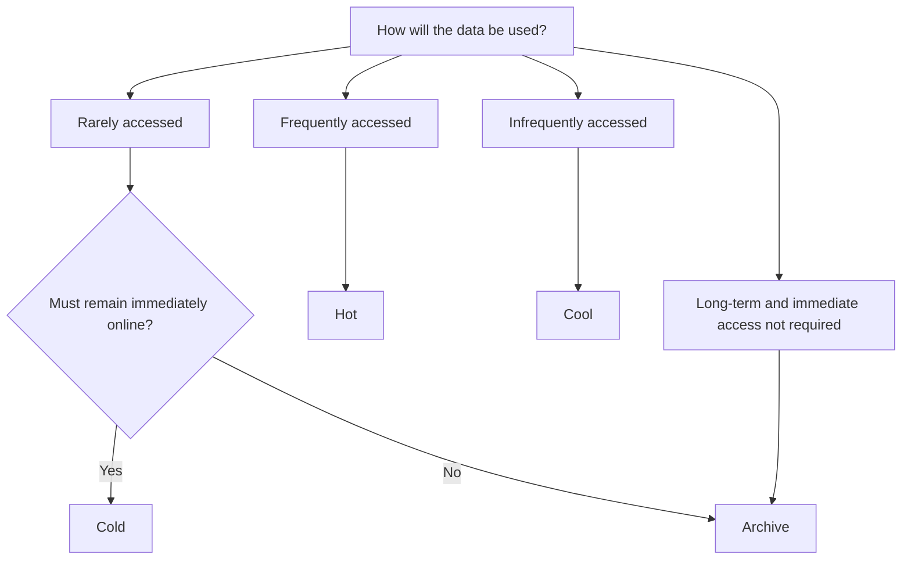

# Blob Access Tiers

## Definition

Azure Blob Storage provides different access tiers that allow data to be stored according to how frequently it is accessed.

Choosing the correct tier helps balance:

- storage cost
- access cost
- access frequency
- availability requirements

The main access tiers are:

- Hot
- Cool
- Cold
- Archive

## Access Tier Comparison

| Tier | Access Pattern | Availability | Storage Cost | Access Cost |
|---|---|---|---|---|
| **Hot** | Frequently accessed | Online | Highest | Lowest |
| **Cool** | Infrequently accessed | Online | Lower | Higher |
| **Cold** | Rarely accessed | Online | Lower than Cool | Higher |
| **Archive** | Rarely accessed / long-term | Offline | Lowest | Highest / rehydration required |

## Decision Factors

Do not choose a tier based only on how often the data is accessed.

Consider:

```text
ACCESS FREQUENCY
        +
ONLINE AVAILABILITY
        +
COST
        ↓
BEST-FIT TIER
```



> **Key distinction:** Cold is rarely accessed but remains online. Archive is offline.

## Changing Access Tiers

Access tiers are **not permanently fixed when a blob is created**.

A blob can move between tiers as its usage pattern changes.

```text
Hot ↔ Cool ↔ Cold
          ↓
       Archive
          ↓
      Rehydrate
          ↓
     Online tier
```

Hot, Cool, and Cold are **online tiers**.

Archive is an **offline tier**. Archived data must be rehydrated to an online tier before it can be read or modified normally.

The default access tier of a general-purpose v2 storage account can also be changed after the storage account is created.

### Quick Exam Check

```text
Can the access tier change after creation?
→ YES

Can a blob move to another tier?
→ YES

Can archived data be accessed immediately?
→ NO

Must archived data be rehydrated?
→ YES

Can Archive be the default storage account access tier?
→ NO
```

## Common Mistakes

### Cold vs Archive

Both are designed for rarely accessed data, but:

```text
Cold
→ ONLINE

Archive
→ OFFLINE
→ rehydration required
```

If immediate access is required, **Archive is not the best fit**.

### Choosing Only by Storage Cost

Archive has the lowest storage cost, but that does not automatically make it the best option.

Consider whether the data must remain immediately accessible.

## Exam Reasoning

When the question asks for the best access tier, use this order:

```text
1. How often is the data accessed?

2. Must it remain immediately available?

3. What cost trade-off is acceptable?
```

Then:

```text
Frequent
→ Hot

Infrequent + online
→ Cool

Rare + online
→ Cold

Long-term + offline acceptable
→ Archive
```

For changeability questions:

```text
Access tier
→ CAN CHANGE

Archive data
→ MUST REHYDRATE before normal access
```

> **Access frequency + availability requirement + cost → Best-fit tier**