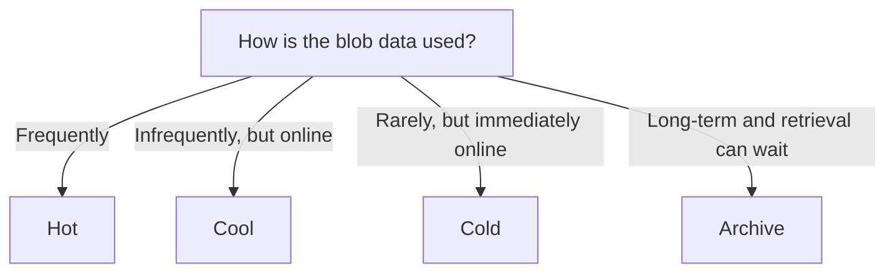

# Blob Access Tiers

## Definition

Azure Blob Storage access tiers help optimize cost based on how frequently data is accessed and how quickly it must be available.

The four primary tiers are:

- Hot
- Cool
- Cold
- Archive

## What Problem Does It Solve?

Not all data has the same access pattern.

Access tiers let organizations trade lower storage cost for higher access cost and, for Archive, slower retrieval.

## Tier Comparison

| Tier | Access Pattern | Online? | Storage Cost | Access Cost |
|---|---|---|---|---|
| Hot | Frequent | Yes | Highest | Lowest |
| Cool | Infrequent | Yes | Lower | Higher |
| Cold | Rare | Yes | Lower | Higher |
| Archive | Long-term / very rare | No | Lowest | Highest |

Typical minimum storage durations are approximately:

- Cool: 30 days
- Cold: 90 days
- Archive: 180 days

## Decision Factors

Ask two questions:

1. **How often is the data accessed?**
2. **Must the data remain immediately available online?**



## Best-Fit Scenarios

```text
Active application data
→ Hot

Infrequent online data
→ Cool

Rarely accessed but immediately online
→ Cold

Long-term retention with rehydration acceptable
→ Archive
```

## Changing Access Tiers

Access tiers are not permanently fixed when data is created.

A blob can be moved between access tiers as its usage pattern changes.

```text
Hot ↔ Cool ↔ Cold
          ↓
       Archive
          ↓
      Rehydrate
          ↓
   Online access tier
```

Hot, Cool, and Cold are **online tiers**.

Archive is an **offline tier**. An archived blob must be rehydrated to an online tier before its data can be read or modified.

The default access tier of a general-purpose v2 storage account can also be changed after the storage account is created.

Archive cannot be configured as the default storage account access tier; it is applied at the blob level.

### Quick Exam Check

```text
Can the access tier change after creation?
→ YES

Can a blob move to another tier?
→ YES

Can archived data be accessed immediately?
→ NO

Must Archive data be rehydrated before normal access?
→ YES

Can Archive be the default storage account access tier?
→ NO
```

### Hot
- frequently accessed
- active data

### Cool
- infrequently accessed
- online

### Cold
- rarely accessed
- online

### Archive
- offline
- long-term retention
- rehydration

## Common Mistakes

Archive is not simply a cheaper online tier.

Archive data is offline and must be rehydrated before it can be read.

Do not choose a tier only from access frequency. Also check whether immediate online access is required.

## Exam Reasoning

```text
Frequency
+
Online availability requirement
+
Cost
→ Best-fit tier
```

> **Hot / Cool / Cold = online. Archive = offline.**
