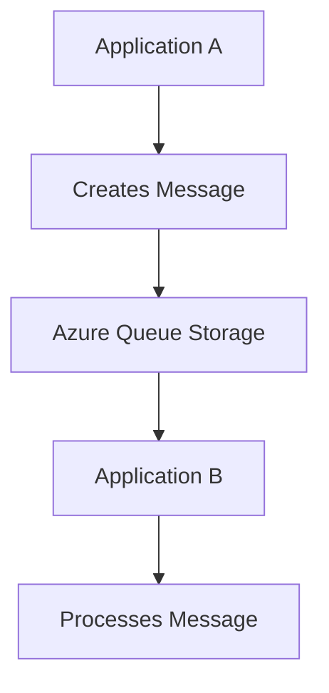

# Azure Queue Storage

## Definition

Azure Queue Storage is a cloud messaging service that enables applications and services to exchange messages asynchronously.

Instead of communicating directly, one application places a message in a queue while another application retrieves and processes it when it is ready.

Queue Storage helps decouple application components, making solutions more reliable and scalable.

## Why Queue Storage Exists

Applications do not always need to process requests immediately.

For example:

- An online store receives a new order.
- An image is uploaded for processing.
- A background task must generate a report.
- A notification email needs to be sent.

Instead of processing everything immediately, applications can place tasks into a queue and process them later.

This improves performance and reliability.

## Characteristics

Azure Queue Storage provides:

- Asynchronous messaging
- Reliable message delivery
- Decoupled application components
- Automatic message persistence
- High scalability

Messages remain in the queue until they are processed or expire.

## How Queue Storage Works

A typical workflow looks like this:

Applications do not need to run at the same time.

This makes Queue Storage ideal for background processing.

## Typical Use Cases

Azure Queue Storage is commonly used for:

- Background jobs
- Order processing
- Image processing
- Email processing
- Distributed applications
- Communication between application components

## Microsoft Trigger Words

If a question contains words such as:

- queue
- message
- asynchronous
- background processing
- decouple applications
- process later

Think:

> Azure Queue Storage

## Common Exam Questions

Microsoft frequently asks questions such as:

- Which Azure storage service stores messages?
- Which Azure service supports asynchronous communication?
- Which Azure service allows applications to process work later?
- Which Azure storage service helps decouple application components?

## Common Mistakes

❌ Thinking Queue Storage stores files.

Queue Storage stores messages, not files.

❌ Thinking Queue Storage executes code.

Azure Functions execute code.

Queue Storage stores the messages that can trigger Azure Functions.

## Compare With

| Azure Queue Storage | Azure Blob Storage |
|---------------------|--------------------|
| Stores messages | Stores unstructured data |
| Supports asynchronous processing | Stores files and media |
| Used between applications | Used for storage |

## Exam Tip

Ask:

> "Is the service storing work to be processed later, or executing the work?"

Store messages for asynchronous processing:

→ **Azure Queue Storage**

Execute code when an event or message arrives:

→ **Azure Functions**

Remember:

> **Queue stores the work. Function processes the work.**