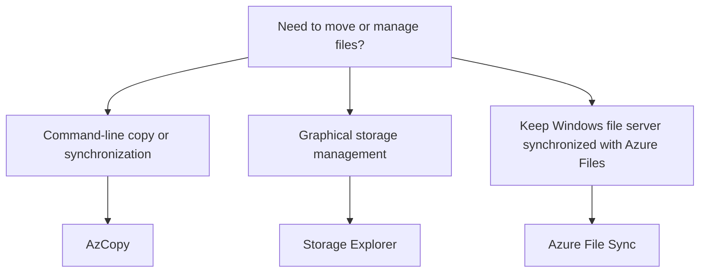

# File Movement Tools

## Definition

Azure provides several tools for moving, managing, or synchronizing files with Azure Storage.

For AZ-900, the important tools are:

- AzCopy
- Azure Storage Explorer
- Azure File Sync

## What Problem Do They Solve?

The tools overlap in the broad area of file movement, but the **interaction model** and **scenario** determine the best fit.

## AzCopy

AzCopy is a command-line utility for copying data to, from, or between Azure Storage locations.

Think:

> **Command line + copy/upload/download/synchronize → AzCopy**

## Azure Storage Explorer

Azure Storage Explorer is a standalone graphical application for working with Azure Storage data.

It provides a GUI for tasks such as uploading, downloading, copying, and managing storage data.

Think:

> **GUI + manage Azure Storage → Storage Explorer**

## Azure File Sync

Azure File Sync synchronizes an on-premises Windows Server file system with Azure Files.

It can keep frequently accessed files locally while less frequently used files are tiered to Azure.

Think:

> **Windows file server ↔ Azure Files → Azure File Sync**

## Decision Factors



## Common Mistakes

Do not choose Azure File Sync for a one-time generic file copy. Its key scenario is synchronization between Windows file servers and Azure Files.

Do not confuse AzCopy and Storage Explorer: both can move data, but one is primarily **CLI** and the other provides a **GUI**.

## Microsoft Trigger Words

```text
CLI / command line
→ AzCopy

GUI / graphical tool
→ Storage Explorer

Windows file server / synchronize / cloud tiering
→ Azure File Sync
```

## Exam Reasoning

Identify **how** the organization wants to interact with or maintain the files, not just that files must be moved.
