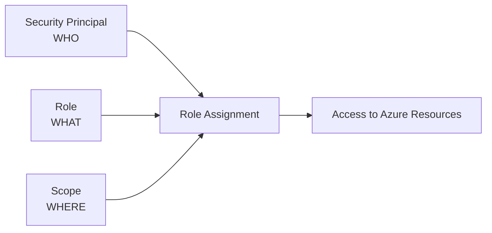
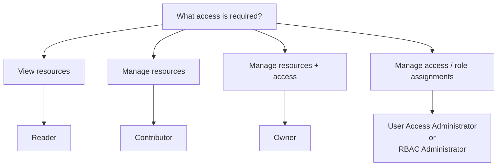

# Azure Role-Based Access Control (RBAC)

## Definition

Azure Role-Based Access Control (Azure RBAC) is Azure's authorization system for controlling access to Azure resources.

For AZ-900, think of RBAC as three questions:

```text
WHO?
→ Security principal

WHAT?
→ Role

WHERE?
→ Scope
```

Together:

```text
WHO + ROLE + SCOPE
→ ACCESS
```

A security principal can be a user, group, service principal, or managed identity.

---

## Role Assignments and Scope

Access is granted through a **role assignment** that combines a security principal, a role, and a scope.



Example:

```text
User: Alex
+
Role: Reader
+
Scope: Resource Group A
        ↓
Alex can read resources
in Resource Group A
```

Azure RBAC scopes follow the Azure resource hierarchy:

```text
Management Group
        ↓
Subscription
        ↓
Resource Group
        ↓
Resource
```

Permissions assigned at a higher scope apply to lower scopes. A role assigned on an unrelated scope does not grant access elsewhere.

Use the **smallest scope that satisfies the requirement**.

```text
One resource
→ Resource scope

All resources in one Resource Group
→ Resource Group scope

Resources across a Subscription
→ Subscription scope
```

---

## Core Azure Roles

| Role | View Resources | Manage Resources | Manage RBAC Role Assignments |
|---|:---:|:---:|:---:|
| **Reader** | ✅ | ❌ | ❌ |
| **Contributor** | ✅ | ✅ | ❌ |
| **Owner** | ✅ | ✅ | ✅ |
| **User Access Administrator** | ✅ | Access-focused | ✅ |
| **Role Based Access Control Administrator** | ✅ | Access-focused | ✅ |

### Mental Model

```text
Reader
→ VIEW

Contributor
→ RESOURCES
→ NOT access

Owner
→ RESOURCES + ACCESS

User Access Administrator
→ ACCESS

Role Based Access Control Administrator
→ RBAC ACCESS
```

The key distinction is:

> **Managing resources and managing access are different permissions.**

---

## Managing Existing Role Assignments

For a question about an existing role assignment, **who created it is usually not the deciding factor**.

Ask instead:

```text
Does the user have permission
to manage role assignments?
        +
Does that permission apply
at this scope or a parent scope?
```

Example:

```text
Resource Group A
└── User A → Reader
```

For that assignment:

```text
Owner at Subscription
→ YES

RBAC Administrator at Resource Group A
→ YES

User Access Administrator at Resource Group A
→ YES

Contributor at Resource Group A
→ NO

Owner only at Resource Group B
→ NO
```

This is true even if the original assignment was created by a different administrator.

> **Permission + Scope determine who can manage the assignment.**

---

## Decision Factors

Start with the required action, then check the scope.



Then ask:

```text
WHAT can the user do?
→ Role

WHERE can the user do it?
→ Scope
```

---

## RBAC vs Identity and Authentication

Do not confuse identity, authentication, and authorization.

```text
Microsoft Entra ID
→ manages identities

Authentication
→ verifies WHO YOU ARE

Azure RBAC
→ determines WHAT YOU CAN DO
  to Azure resources
```

Example:

```text
User successfully signs in
→ Authentication

User can restart a VM
→ Authorization / Azure RBAC
```

---

## Exam Traps and Reasoning

### Contributor vs Owner

```text
Contributor
→ manage resources
→ CANNOT manage RBAC role assignments

Owner
→ manage resources
→ CAN manage RBAC role assignments
```

Do not assume that permission to modify a resource also means permission to modify **who has access** to it.

### Role vs Scope

A correct role at the wrong scope may not satisfy the requirement.

For every RBAC scenario, ask:

```text
1. WHO needs access?
2. WHAT must they be able to do?
3. WHERE must they be able to do it?
```

Quick selection:

```text
View only
→ Reader

Manage resources
→ Contributor

Manage resources + access
→ Owner

Manage role assignments
→ User Access Administrator
  or RBAC Administrator
```

For an existing role assignment:

```text
Who created it?
→ usually irrelevant

Who can manage it?
→ check role-assignment permission

Where can they manage it?
→ check scope
```

> **RBAC = WHO + ROLE + SCOPE**
