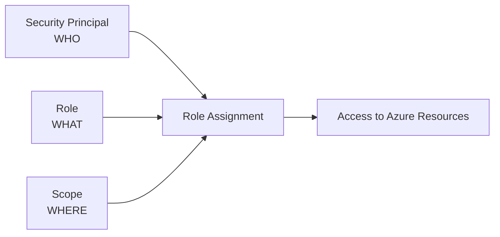
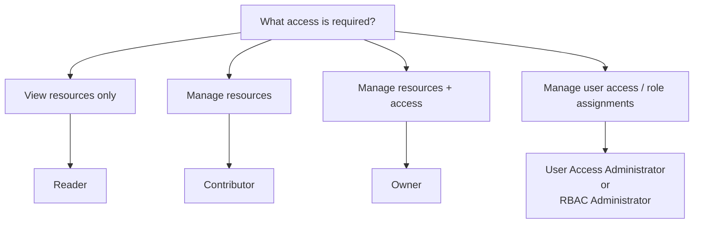
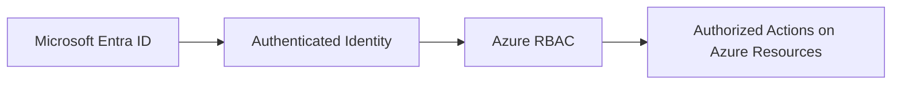

# Azure Role-Based Access Control (RBAC)

## Definition

Azure Role-Based Access Control (Azure RBAC) is Azure's authorization system for managing access to Azure resources.

RBAC determines:

> **Who can do what, and where?**

A role assignment combines three main elements:

```text
WHO
→ Security principal

WHAT
→ Role

WHERE
→ Scope
```

Examples of security principals include:

- users
- groups
- service principals
- managed identities

## What Problem Does It Solve?

Organizations need to control who can access Azure resources and what actions those users or identities can perform.

Azure RBAC allows permissions to be granted according to job responsibilities instead of giving everyone unrestricted access.

Example:

```text
User needs to view resources
but must not modify them
        ↓
Reader
```

RBAC supports the principle of **least privilege**:

> Grant only the permissions required to perform the task.

## Role Assignments

Access is granted by creating a **role assignment**.

A role assignment connects:



For example:

```text
User: Alex
+
Role: Reader
+
Scope: Resource Group A
        ↓
Alex can read resources
inside Resource Group A
```

## RBAC Scope

Azure RBAC roles can be assigned at different scopes:

```text
Management Group
        ↓
Subscription
        ↓
Resource Group
        ↓
Resource
```

Permissions assigned at a higher scope are inherited by lower scopes.

Example:

```text
Reader at Subscription
        ↓
Reader access to resource groups
        ↓
Reader access to resources
```

A role assigned directly to one resource has a much narrower scope.

### Decision Principle

Use the **smallest scope that satisfies the requirement**.

```text
Need access to one resource
→ Resource scope

Need access to all resources in one Resource Group
→ Resource Group scope

Need access across a Subscription
→ Subscription scope
```

## Core Azure Roles

For AZ-900, understand these fundamental roles.

| Role | Main Purpose |
|---|---|
| **Owner** | Full resource management + manage access |
| **Contributor** | Manage resources but not role assignments |
| **Reader** | View resources |
| **User Access Administrator** | Manage user access |
| **Role Based Access Control Administrator** | Manage Azure RBAC access |

## Owner

The Owner role provides full control over Azure resources and can also assign Azure RBAC roles.

```text
Owner
→ Manage resources
→ Create / modify / delete resources
→ Manage access
→ Assign Azure RBAC roles
```

Think:

> **Resources + Access → Owner**

## Contributor

Contributor can create and manage Azure resources.

However, Contributor **cannot assign Azure RBAC roles**.

```text
Contributor
→ Manage resources
→ Create / modify / delete resources
→ CANNOT assign Azure RBAC roles
```

Think:

> **Resources, but not Access → Contributor**

This distinction is especially important for exam scenarios.

## Reader

Reader can view Azure resources but cannot modify them.

```text
Reader
→ View resources
→ No modification
→ No role assignment management
```

Think:

> **View only → Reader**

## User Access Administrator

User Access Administrator focuses on managing access to Azure resources.

```text
User Access Administrator
→ Manage user access
→ Manage Azure role assignments
```

Think:

> **Manage Access → User Access Administrator**

## Role Based Access Control Administrator

Role Based Access Control Administrator can manage access to Azure resources through Azure RBAC.

```text
Role Based Access Control Administrator
→ Manage Azure RBAC access
→ Assign Azure roles
```

Think:

> **Manage RBAC → Role Based Access Control Administrator**

It is focused on Azure RBAC access management rather than general Azure resource management.

## Who Can Manage Role Assignments?

Managing Azure resources and managing **access to those resources** are different permissions.

| Role | Manage Resources | View Resources | Manage Azure RBAC Role Assignments |
|---|:---:|:---:|:---:|
| **Owner** | ✅ | ✅ | ✅ |
| **Contributor** | ✅ | ✅ | ❌ |
| **Reader** | ❌ | ✅ | ❌ |
| **User Access Administrator** | Access-focused | ✅ | ✅ |
| **Role Based Access Control Administrator** | Access-focused | ✅ | ✅ |

The critical distinction is:

```text
Owner
→ Resources + Access

Contributor
→ Resources
→ NOT role assignments

Reader
→ View only

User Access Administrator
→ Access

Role Based Access Control Administrator
→ RBAC access
```

To create or remove a role assignment, the user needs the appropriate role-assignment permission at the relevant scope.

## Decision Factors

Start by identifying **what the user needs to do**.



Then determine:

> **Where should the permission apply?**

```text
Role
+
Scope
→ Effective access
```

## Authentication vs RBAC

Do not confuse authentication with authorization.

```text
Authentication
→ WHO ARE YOU?

Azure RBAC
→ WHAT CAN YOU DO?
```

Example:

```text
User signs in successfully
→ Authentication

User can restart a VM
→ Authorization / RBAC
```

## Entra ID vs Azure RBAC

Microsoft Entra ID manages identities and authentication.

Azure RBAC manages authorization to Azure resources.

```text
Microsoft Entra ID
→ Identity

Azure RBAC
→ Resource permissions
```

They work together:



## Common Mistakes

### Contributor vs Owner

This is one of the most important RBAC distinctions.

```text
Contributor
→ Manage resources
→ CANNOT assign roles

Owner
→ Manage resources
→ CAN assign roles
```

Do not assume that someone who can modify a resource can also modify **who has access to the resource**.

### Reader vs Contributor

```text
Reader
→ View

Contributor
→ Manage
```

Reader cannot modify Azure resources.

### Contributor vs User Access Administrator

```text
Contributor
→ Manage RESOURCES

User Access Administrator
→ Manage ACCESS
```

These solve different problems.

### Role vs Scope

Knowing the role is not always enough.

Consider:

```text
WHAT can the user do?
→ Role

WHERE can they do it?
→ Scope
```

Example:

```text
Contributor
at Resource Group A
```

does not automatically mean:

```text
Contributor
across the entire Subscription
```

## Exam Reasoning

For RBAC questions, use three questions:

```text
1. WHO needs access?

2. WHAT must they be able to do?

3. WHERE must they be able to do it?
```

Mental model:

```text
WHO
+
ROLE
+
SCOPE
=
ACCESS
```

For the fundamental roles:

```text
View only
→ Reader

Manage resources
but NOT access
→ Contributor

Manage resources
AND access
→ Owner

Manage access / role assignments
→ User Access Administrator
  or RBAC Administrator
```

### High-Value Exam Trap

If the scenario says:

```text
User has Contributor role
+
User can modify Azure resources
```

do **not** conclude:

```text
User can modify role assignments
```

Contributor does not have that permission.

If the question asks:

> Who can assign or manage Azure RBAC roles?

Think:

```text
Owner
User Access Administrator
Role Based Access Control Administrator
```

Then check the **scope** at which the role was assigned.

> **Resource management permission does not automatically mean access-management permission.**