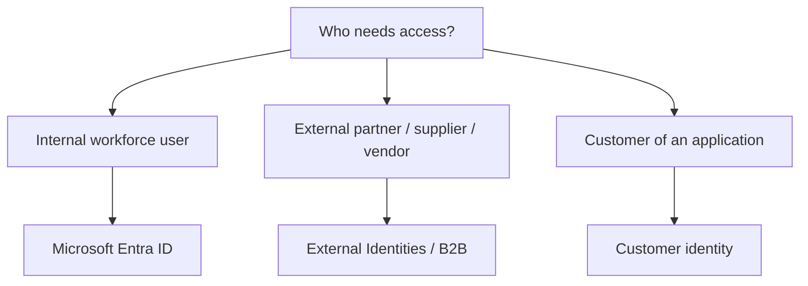

# External Identities

## Definition

Microsoft Entra External ID supports secure identity and access scenarios for users outside an organization.

External users can include partners, suppliers, vendors, and customers.

## What Problem Does It Solve?

Organizations often need to provide access to people who are not part of their internal workforce without creating and managing them exactly like internal employees.

## Key Scenarios

### Business-to-Business (B2B)

B2B collaboration enables external partners or guest users to access organizational resources while using their own identities where supported.

Think:

> **Partner / supplier / vendor needs access to organizational resources → B2B**

### Customer Identity

Customer identity scenarios provide identity and access capabilities for users of customer-facing applications.

Think:

> **Customer signs in to a customer-facing application → Customer identity**

## Decision Factors



## Common Mistakes

Do not confuse external collaboration with Azure RBAC.

External identity determines **who the external user is and how they participate in the identity system**. Azure RBAC can then be used, when appropriate, to authorize that identity to Azure resources.

## Exam Reasoning

```text
EXTERNAL BUSINESS COLLABORATOR?
→ External Identities / B2B

CUSTOMER-FACING APPLICATION USER?
→ Customer identity
```
