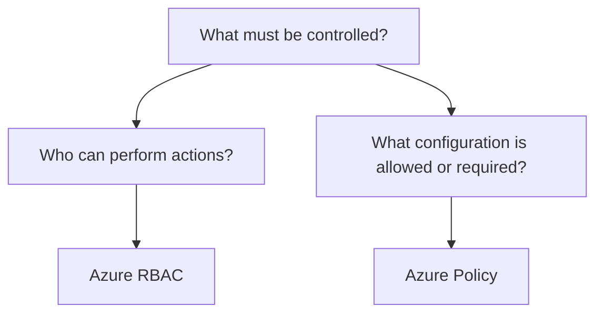

# Azure Policy

## Definition

Azure Policy is an Azure governance service used to enforce standards and assess compliance across Azure resources.

It answers:

> **What resource configurations are allowed or required?**

Azure Policy is different from Azure RBAC. RBAC controls **who can perform actions**; Policy controls **resource configuration and compliance**.

## What Problem Does It Solve?

Organizations may need to ensure that resources follow corporate or regulatory requirements.

Examples include:

- allow resources only in approved Azure regions;
- require specific tags;
- restrict virtual machine sizes;
- require particular configurations;
- audit resources for compliance;
- prevent creation of non-compliant resources.

## Scope and Inheritance

Policies can be assigned at Azure scopes such as:

```text
Management Group
        ↓
Subscription
        ↓
Resource Group
        ↓
Resources
```

A policy assigned at a higher scope can apply to resources below that scope.

The important distinction is:

```text
RBAC scope
→ where PERMISSIONS apply

Policy scope
→ where GOVERNANCE RULES apply
```

## Decision Factors

Choose Azure Policy when the requirement is to **evaluate, require, restrict, or enforce resource configuration**.



Examples:

```text
Only approved Azure regions
→ Azure Policy

Restrict VM sizes
→ Azure Policy

Require specific tags
→ Azure Policy

Audit resource compliance
→ Azure Policy
```

## Azure Policy vs Azure RBAC

| Decision Factor | Azure Policy | Azure RBAC |
|---|---|---|
| Primary question | What configuration is allowed or required? | Who can perform which actions? |
| Focus | Governance and compliance | Authorization |
| Controls | Resource configuration | User/identity permissions |
| Example | Restrict deployment regions | Give user Reader access |

## Common Exam Trap

Do not choose Policy merely because the scenario involves an administrator.

Ask what is being controlled:

```text
WHO can do it?
→ RBAC

WHAT configuration is allowed?
→ Policy
```

## Exam Reasoning

```text
Require / restrict / audit resource configuration
→ Azure Policy

Control user permissions
→ Azure RBAC

Prevent accidental deletion or modification
→ Resource Locks

Organize with metadata
→ Resource Tags
```

> **Policy = configuration and compliance, not user permissions.**
