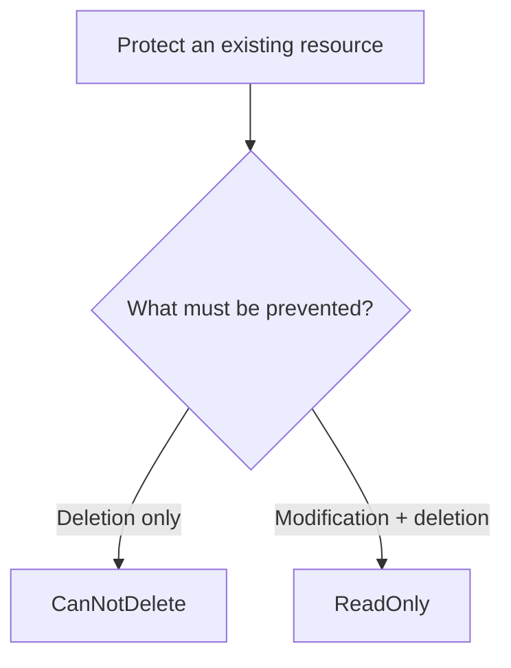

# Resource Locks

## Definition

Azure Resource Locks protect Azure resources from accidental deletion or modification.

A lock does **not** determine who is authorized to access a resource. It adds protection even when a user already has sufficient permissions to perform an operation.

## Lock Types

| Lock | Read | Modify | Delete |
|---|:---:|:---:|:---:|
| **CanNotDelete** | ✅ | ✅ | ❌ |
| **ReadOnly** | ✅ | ❌ | ❌ |

### CanNotDelete

Use when authorized users should still be able to modify the resource but must not delete it.

```text
Modify
→ YES

Delete
→ NO
```

### ReadOnly

Use when authorized users should be able to read the resource but must not modify or delete it.

```text
Read
→ YES

Modify
→ NO

Delete
→ NO
```

## Scope and Inheritance

Locks can be applied at scopes such as:

```text
Subscription
        ↓
Resource Group
        ↓
Resource
```

A lock applied at a parent scope is inherited by resources below that scope.

Example:

```text
CanNotDelete lock on Resource Group
        ↓
Resources in the group
        ↓
Cannot be deleted while the lock applies
```

## Decision Factors

Ask what protection is required:



## Resource Locks vs RBAC vs Policy

| Requirement | Best Fit |
|---|---|
| Control who can perform actions | **Azure RBAC** |
| Enforce or audit configuration | **Azure Policy** |
| Prevent deletion or modification | **Resource Locks** |

## Common Exam Trap — Administrative Actions

A phrase such as:

> **protect resources from accidental administrative actions**

does not automatically mean RBAC.

First ask:

```text
Control WHO is authorized?
→ RBAC

Protect the RESOURCE from delete/update operations?
→ Resource Lock
```

Then distinguish the lock type:

```text
Prevent deletion but allow modification
→ CanNotDelete

Prevent modification and deletion
→ ReadOnly
```

## Exam Reasoning

```text
CanNotDelete
→ read YES
→ modify YES
→ delete NO

ReadOnly
→ read YES
→ modify NO
→ delete NO
```

> **Locks protect resources; RBAC controls permissions; Policy controls configuration.**
