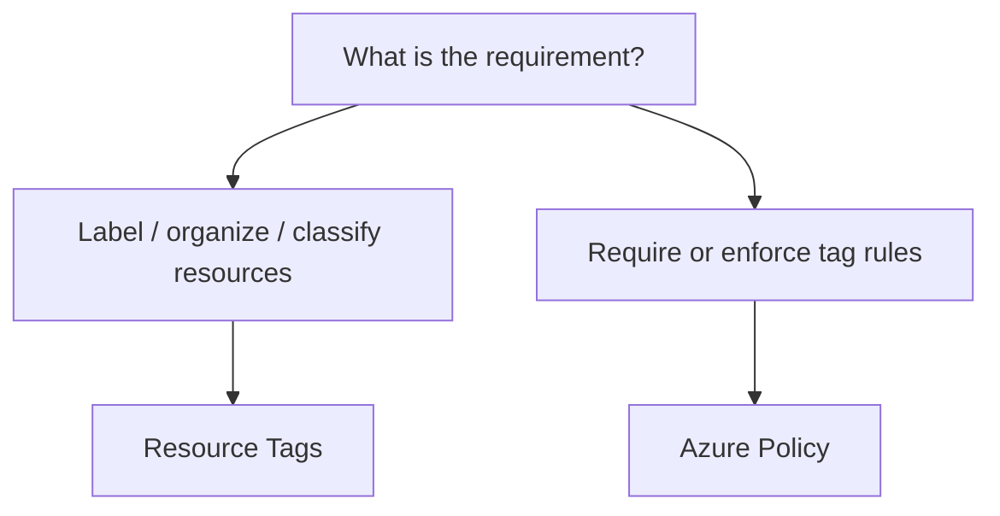

# Resource Tags

## Definition

Azure Resource Tags are name-value pairs used to organize, classify, and report on Azure resources.

Examples:

```text
Environment = Production
Department = Finance
Project = Website
CostCenter = CC-1001
```

Tags provide metadata. They do not provide access control or resource protection.

## What Problem Do They Solve?

Tags are useful for:

- organization and classification;
- identifying ownership or environment;
- filtering and reporting;
- cost allocation and grouping.

## Tags Are Not Inherited by Default

This is an important exam distinction.

```text
Tag applied to Resource Group
        ↓
Do resources automatically receive the tag?
        ↓
NO
```

Azure Policy can be used when an organization needs to require or apply tag-related rules.

## Decision Factors



Think:

```text
Metadata / organization
→ Tags

Enforcement
→ Policy
```

## Tags vs Policy

| Decision Factor | Resource Tags | Azure Policy |
|---|---|---|
| Purpose | Metadata and organization | Governance enforcement |
| Example | Department = Finance | Require Department tag |
| Access control | No | No |
| Protect from deletion | No | No |

## Common Exam Traps

```text
Tags
≠ RBAC

Tags
≠ Resource Locks

Tags
≠ automatic inheritance
```

A tag on a Resource Group does not automatically appear on every resource in that group.

## Exam Reasoning

```text
Organize / classify / cost grouping
→ Resource Tags

Require a tag or enforce a configuration
→ Azure Policy

Control permissions
→ Azure RBAC

Prevent delete / modify
→ Resource Locks
```

> **Tags = metadata, not enforcement.**
