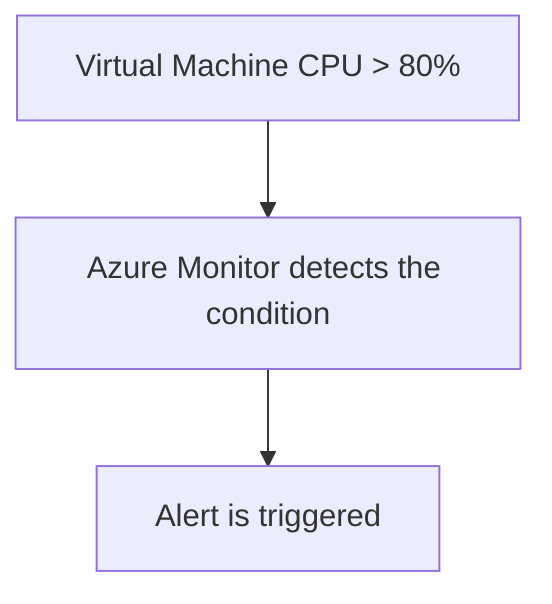

# Azure Monitor

## Definition

Azure Monitor is Microsoft's centralized monitoring service for collecting, analyzing, and responding to telemetry from Azure resources and applications.

It helps organizations understand the performance, availability, and health of their Azure environments.

## Why Azure Monitor Exists

Cloud environments can contain many resources, including:

- Virtual Machines
- Applications
- Databases
- Storage Accounts
- Networks

Administrators need a central place to monitor these resources and identify performance or availability problems.

Azure Monitor provides this centralized monitoring capability.

## Characteristics

Azure Monitor provides:

- Metrics
- Logs
- Alerts
- Dashboards
- Monitoring of Azure resources
- Integration with Application Insights

Azure Monitor can collect telemetry from both Azure resources and applications.

## Metrics

Metrics are numerical measurements collected over time.

Examples include:

- CPU utilization
- Memory usage
- Network traffic
- Request count

Metrics are useful for identifying performance trends and creating alerts.

## Logs

Logs contain detailed records about events and activities.

They can be queried and analyzed to investigate:

- Errors
- Performance problems
- Resource activity
- System behavior

## Alerts

Azure Monitor can automatically notify administrators when predefined conditions occur.

Example:

Alerts can help administrators respond quickly to performance or availability problems.

## Typical Use Cases

Azure Monitor is commonly used for:

- Monitoring CPU utilization
- Collecting logs
- Creating alerts
- Monitoring resource performance
- Troubleshooting Azure environments

## Microsoft Trigger Words

If a question contains words such as:

- metrics
- logs
- alerts
- CPU utilization
- telemetry
- monitor resources

Think:

> Azure Monitor

## Common Exam Questions

Microsoft frequently asks questions such as:

- Which Azure service collects metrics and logs?
- Which Azure service can create an alert when CPU utilization exceeds a threshold?
- Which Azure service monitors the performance of Azure resources?

## Common Mistakes

❌ Thinking Azure Monitor provides optimization recommendations.

Azure Advisor provides recommendations.

Azure Monitor collects and analyzes monitoring data.

❌ Thinking Azure Monitor reports only Azure platform outages.

Azure Service Health provides personalized information about Azure service issues and planned maintenance.

Azure Monitor focuses on telemetry from resources and applications.

## Compare With

| Azure Monitor | Azure Advisor |
|---------------|---------------|
| Metrics, logs, and alerts | Recommendations |
| Monitors resources | Analyzes configurations |
| Detects operational conditions | Suggests improvements |

## Exam Tip

Ask yourself:

> "Do I need to observe what my resources are doing?"

If the requirement involves metrics, logs, alerts, or resource performance, think:

> **Azure Monitor**

If the requirement asks what should be improved, think **Azure Advisor**.

If it asks whether Azure itself is experiencing an incident or planned maintenance, think **Azure Service Health**.