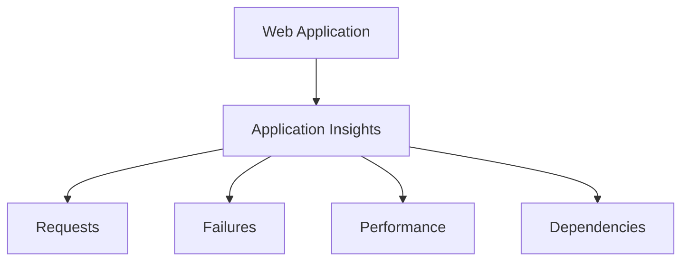

# Application Insights

## Definition

Application Insights is an application performance monitoring feature of Azure Monitor.

It collects telemetry from applications to help developers understand application performance, usage, failures, and availability.

## Why Application Insights Exists

Azure Monitor can monitor Azure infrastructure, but developers also need visibility into what happens inside their applications.

For example:

- How long does a request take?
- Which requests are failing?
- Which application dependencies are slow?
- How are users interacting with the application?

Application Insights provides this application-level telemetry.

## Characteristics

Application Insights provides:

- Application performance monitoring
- Request telemetry
- Failure tracking
- Dependency monitoring
- Application usage information
- Availability monitoring

Application Insights is part of the Azure Monitor ecosystem.

## Typical Use Cases

Application Insights is commonly used for:

- Monitoring web application performance
- Finding application errors
- Measuring request response times
- Tracking failed requests
- Monitoring application dependencies
- Troubleshooting application performance

## Example

This allows developers to investigate problems inside the application rather than only monitoring the infrastructure hosting it.

## Microsoft Trigger Words

If a question contains words such as:

- application performance
- failed requests
- response time
- application telemetry
- dependencies
- web application monitoring

Think:

> Application Insights

## Common Exam Questions

Microsoft may ask questions such as:

- Which Azure feature monitors application performance?
- Which Azure feature tracks failed application requests?
- Which Azure feature provides application telemetry?

## Common Mistakes

❌ Thinking Application Insights replaces Azure Monitor.

Application Insights is part of Azure Monitor and focuses specifically on application performance monitoring.

❌ Thinking Application Insights monitors Azure platform outages.

Azure Service Health provides information about Azure service incidents and planned maintenance.

## Compare With

| Application Insights | Azure Monitor |
|----------------------|---------------|
| Application-focused telemetry | Central monitoring platform |
| Requests and failures | Metrics, logs, and alerts |
| Application performance | Resource and application monitoring |
| Developer-focused | Broader operational monitoring |

## Exam Tip

First identify **what is being monitored**.

If the question focuses on:

- the application itself
- failed requests
- response times
- application dependencies

think:

> **Application Insights**

If the question focuses more broadly on Azure resource metrics, logs, or alerts, think:

> **Azure Monitor**