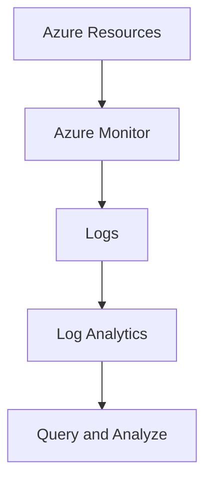

# Log Analytics

## Definition

Log Analytics is a tool in Azure Monitor used to query and analyze log data collected from Azure resources and applications.

It allows administrators to investigate operational data, troubleshoot problems, identify trends, and better understand what is happening across an Azure environment.

## Why Log Analytics Exists

Azure environments can generate large amounts of log data.

Examples include:

- Virtual Machine events
- Application logs
- Resource activity
- Performance data
- Security-related events

Simply collecting this information is not enough.

Administrators need a way to search, filter, correlate, and analyze the collected data.

Log Analytics provides this capability.

## Log Analytics Workspace

Log data can be stored in a **Log Analytics workspace**.

A workspace provides a centralized location where collected log data can be queried and analyzed.

Multiple Azure resources can send monitoring data to the same workspace.

## Querying Logs

Log Analytics uses **Kusto Query Language (KQL)** to query log data.

Queries can be used to:

- Search logs
- Filter events
- Investigate errors
- Analyze resource behavior
- Identify performance trends

For AZ-900, you do not need to know how to write complex KQL queries.

The important concept is:

> **Log Analytics is used to query and analyze Azure Monitor log data.**

## Relationship with Azure Monitor

Azure Monitor is the overall monitoring platform.

Log Analytics is one of the tools used to analyze the log data collected by Azure Monitor.

## Typical Use Cases

Log Analytics is commonly used for:

- Troubleshooting Azure resources
- Investigating errors
- Searching collected logs
- Analyzing historical operational data
- Identifying patterns across multiple resources

## Microsoft Trigger Words

If a question contains words such as:

- query logs
- analyze logs
- Log Analytics workspace
- KQL
- search monitoring data
- investigate log data

Think:

> Log Analytics

## Common Exam Questions

Microsoft may ask questions such as:

- Which Azure Monitor tool can be used to query log data?
- Which Azure service uses Kusto Query Language (KQL)?
- Where can Azure Monitor log data be analyzed?
- What is the purpose of a Log Analytics workspace?

## Common Mistakes

❌ Thinking Log Analytics and Azure Monitor are separate competing monitoring services.

Azure Monitor is the overall monitoring platform.

Log Analytics is a tool used to query and analyze log data within the Azure Monitor ecosystem.

❌ Thinking Log Analytics provides optimization recommendations.

Azure Advisor provides recommendations.

Log Analytics is used to investigate and analyze collected log data.

## Compare With

| Log Analytics | Azure Monitor |
|---------------|---------------|
| Queries and analyzes logs | Overall monitoring platform |
| Uses KQL | Collects metrics, logs, and telemetry |
| Investigation and analysis | Monitoring, alerts, and observability |

## Exam Tip

Ask yourself:

> "Do I need to collect monitoring data or analyze the logs?"

If the requirement is about:

- metrics
- alerts
- general resource monitoring

→ **Azure Monitor**

If the requirement is about:

- querying logs
- searching collected data
- KQL
- Log Analytics workspace

→ **Log Analytics**

The strongest exam clue is:

> **query logs using KQL**