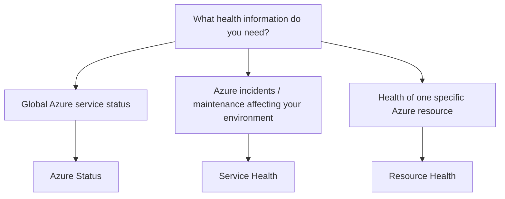

# Azure Service Health

## Definition

Azure Service Health provides personalized information about the health of Azure services and regions that affect your resources.

It helps organizations understand Azure service incidents, planned maintenance, and other service-related events.

## Why Azure Service Health Exists

A problem with an application does not always originate from the application itself.

Sometimes Microsoft Azure may experience:

- Service incidents
- Regional disruptions
- Planned maintenance
- Service changes that may affect workloads

Azure Service Health helps determine whether an issue originates from the Azure platform rather than from the customer's resources.

## Service Health Information

Azure Service Health provides personalized information about events that may affect your Azure environment.

### Service Issues

Active problems with Azure services that may affect your resources.

### Planned Maintenance

Scheduled Azure maintenance that may affect service availability.

### Health Advisories

Important service changes or issues that may require customer attention.

### Security Advisories

Notifications about security-related events that may affect Azure services or resources.

### Billing Updates

Notifications about billing-related events relevant to your Azure environment.

## Azure Status vs Service Health vs Resource Health

The key difference is **scope**.



### Azure Status

Provides a broad global view of Azure service availability.

### Service Health

Provides a personalized view of Azure service incidents, planned maintenance, and advisories relevant to the services and regions you use.

### Resource Health

Provides information about the current health and availability of an individual Azure resource.

### Remember

```text
GLOBAL AZURE
→ Azure Status

AZURE PLATFORM + MY ENVIRONMENT
→ Service Health

ONE SPECIFIC RESOURCE
→ Resource Health
```

## Typical Use Cases

Azure Service Health is commonly used for:

- Checking Azure service incidents
- Reviewing planned maintenance
- Receiving service health notifications
- Determining whether Azure platform issues affect your environment

## Decision Factors

Choose the health tool based on **scope**, not simply on the word *health*.

```text
Broad Azure availability
→ Azure Status

Incidents / maintenance relevant to services and regions you use
→ Service Health

Availability of one deployed resource
→ Resource Health
```

## Microsoft Trigger Words

If a question contains words such as:

- Azure outage
- service incident
- planned maintenance
- service issue
- health advisory
- Azure service health

Think:

> Azure Service Health

## Common Exam Questions

Microsoft frequently asks questions such as:

- Which Azure service reports outages that affect your resources?
- Which Azure service provides information about planned maintenance?
- Which Azure service provides personalized information about Azure service incidents?
- Which service shows the health of an individual Azure resource?

## Common Mistakes

❌ Thinking Azure Service Health monitors CPU utilization.

Azure Monitor provides resource metrics and alerts.

Azure Service Health reports Azure platform service events.

❌ Confusing Service Health with Resource Health.

Service Health focuses on Azure services and regions that may affect you.

Resource Health focuses on the health of an individual Azure resource.

## Compare With

| Azure Service Health | Azure Monitor |
|----------------------|---------------|
| Azure platform incidents | Resource and application telemetry |
| Planned maintenance | Metrics and logs |
| Service advisories | Alerts based on monitored conditions |
| Platform-focused | Workload-focused |

## Exam Reasoning

Ask:

> **Whose health problem am I investigating?**

```text
My workload metrics or logs
→ Azure Monitor

Azure platform incident or planned maintenance affecting me
→ Service Health

One specific Azure resource
→ Resource Health

Broad Azure service availability
→ Azure Status
```

The strongest distinction is **scope**.
