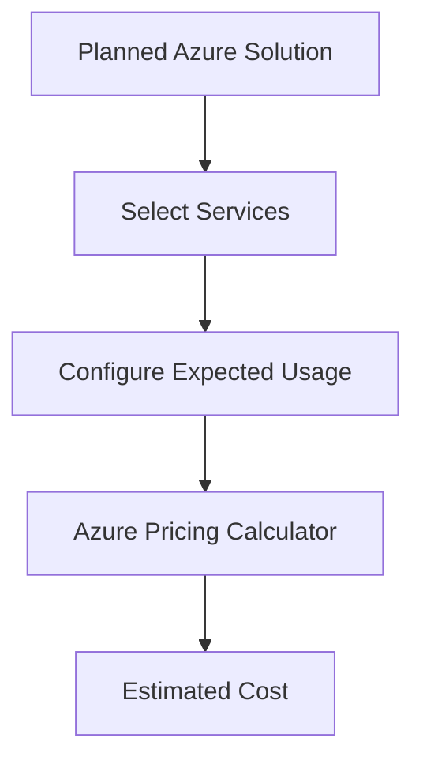

# Azure Pricing Calculator

## Definition

The Azure Pricing Calculator is a Microsoft tool used to estimate the expected cost of Azure services before deploying them.

Users select Azure services and configure expected usage to create an estimated monthly cost.

## Why the Azure Pricing Calculator Exists

Before migrating or deploying workloads to Azure, organizations need to understand how much the planned solution may cost.

The Azure Pricing Calculator allows organizations to model a proposed Azure environment before resources are created.

For example, an estimate might include:

- Virtual Machines
- Storage
- Databases
- Networking
- Other Azure services

## How It Works

A user selects the Azure services required for a planned solution and configures relevant parameters.

For example:

The result is an **estimate**, not the actual Azure bill.

## Typical Use Cases

The Azure Pricing Calculator is commonly used for:

- Planning a new Azure deployment
- Estimating migration costs
- Comparing Azure configurations
- Creating preliminary cloud budgets
- Evaluating different service options

## Estimate vs Actual Cost

This distinction is important for AZ-900.

| Azure Pricing Calculator | Microsoft Cost Management |
|--------------------------|---------------------------|
| Estimate future costs | Analyze actual spending |
| Used before deployment | Used with deployed resources |
| Planning tool | Cost monitoring and management |
| Expected usage | Actual consumption |

## Microsoft Trigger Words

If a question contains words such as:

- estimate
- before deployment
- planned solution
- expected monthly cost
- calculate expected Azure cost

Think:

> Azure Pricing Calculator

## Common Exam Questions

Microsoft frequently asks questions such as:

- Which Azure tool estimates the cost of a planned deployment?
- Which tool should be used before deploying Azure resources?
- Which Azure tool estimates monthly costs based on expected usage?

## Common Mistakes

❌ Thinking the Azure Pricing Calculator shows the actual Azure bill.

The Pricing Calculator provides an estimate.

Microsoft Cost Management is used to analyze actual Azure spending.

❌ Thinking the estimate guarantees the final cost.

Actual costs depend on real resource consumption, configuration, pricing, and other factors.

## Compare With

| Pricing Calculator | Cost Management |
|--------------------|-----------------|
| Before deployment | After resources are deployed |
| Estimate | Actual spending |
| Planning | Monitoring and optimization |

## Exam Tip

Ask one question:

> **Has the workload been deployed yet?**

If the company wants to estimate the cost of a **planned** Azure solution:

→ **Azure Pricing Calculator**

If the company wants to analyze or control **actual Azure spending**:

→ **Microsoft Cost Management**

Remember:

> **Before deployment = Pricing Calculator**  
> **Actual spending = Cost Management**