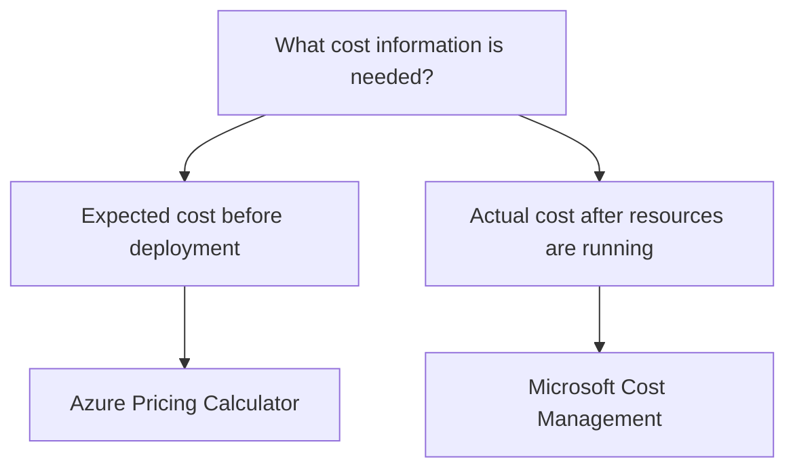

# Azure Pricing Calculator

## Definition

The Azure Pricing Calculator is a public tool used to **estimate the expected cost of planned Azure resources and solutions**.

It helps answer:

> **What might this Azure solution cost before I deploy it?**

## What Problem Does It Solve?

Before deploying Azure resources, an organization may need to compare configurations and estimate expected spending.

The Pricing Calculator can model factors such as:

- Azure service and resource type;
- region;
- configuration or size;
- expected usage;
- storage options;
- networking usage;
- eligible pricing options.

The result is an **estimate**, not the final Azure bill.

## Decision Factors

Start with the timing of the requirement.



Think:

```text
PLANNED solution
→ Pricing Calculator

RUNNING resources / ACTUAL spending
→ Microsoft Cost Management
```

## Pricing Calculator vs Microsoft Cost Management

| Decision Factor | Azure Pricing Calculator | Microsoft Cost Management |
|---|---|---|
| Main purpose | Estimate expected cost | Analyze and manage actual spending |
| Typical timing | Before deployment | During / after usage |
| Uses actual Azure consumption data | No | Yes |
| Typical question | "What might this solution cost?" | "Why are we spending this amount?" |

## Common Mistakes

### Treating an Estimate as the Final Bill

The Pricing Calculator provides an estimate based on the configuration and expected usage entered.

### Using It to Analyze Existing Spending

If the requirement is to investigate actual Azure charges or spending trends, use Microsoft Cost Management instead.

## Exam Reasoning

```text
Estimate BEFORE deployment
→ Azure Pricing Calculator

Analyze ACTUAL spending
→ Microsoft Cost Management
```

> **Planned cost → Pricing Calculator. Actual cost → Cost Management.**
