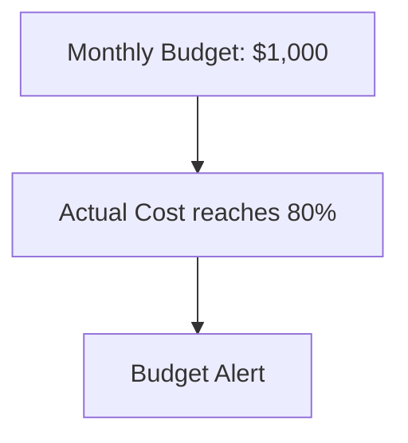
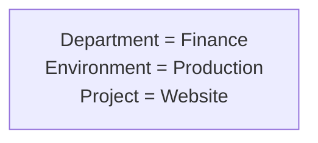

# Microsoft Cost Management

## Definition

Microsoft Cost Management is a set of tools that helps organizations monitor, analyze, manage, and optimize their Azure spending.

It provides visibility into actual cloud costs and helps organizations understand where money is being spent.

## Why Microsoft Cost Management Exists

As organizations deploy more Azure resources, cloud spending can become difficult to track.

Organizations need to answer questions such as:

- How much are we spending?
- Which resources generate the highest costs?
- Which department is responsible for the spending?
- Are we approaching our budget?

Microsoft Cost Management provides tools for answering these questions.

## Core Capabilities

Microsoft Cost Management provides:

- Cost Analysis
- Budgets
- Cost alerts
- Anomaly alerts
- Scheduled alerts
- Cost allocation
- Cost reporting
- Cost optimization insights

## Cost Analysis

Cost Analysis allows organizations to explore and analyze Azure spending.

Costs can be viewed and grouped by dimensions such as:

- Subscription
- Resource Group
- Resource
- Service
- Location
- Tags

This helps identify where Azure spending originates.

## Budgets

Budgets allow organizations to define spending thresholds.

For example:

Budgets help monitor spending but do not automatically stop Azure resources when the budget is reached.

## Cost Alerts

Cost alerts notify users when spending reaches configured thresholds.

They help organizations react before spending exceeds expected limits.

## Resource Tags and Cost Management

Resource Tags can help categorize resources for cost reporting.

For example:

Cost Management can use this metadata to help analyze spending across different organizational categories.

## Microsoft Trigger Words

If a question contains words such as:

- actual spending
- cost analysis
- budget
- spending alert
- cost report
- analyze Azure costs

Think:

> Microsoft Cost Management

## Common Exam Questions

Microsoft frequently asks questions such as:

- Which Azure tool analyzes actual cloud spending?
- Which Azure tool can create budgets?
- Which Azure tool provides cost analysis?
- Which Azure feature can notify users when spending reaches a threshold?

## Common Mistakes

❌ Thinking reaching an Azure budget automatically stops resources.

A budget monitors costs and can trigger notifications when configured thresholds are reached.

The budget itself does not automatically shut down Azure resources.

However, budget notifications can be integrated with automation, such as Action Groups, to trigger additional actions.

## Compare With

| Microsoft Cost Management | Azure Pricing Calculator |
|---------------------------|--------------------------|
| Actual spending | Estimated spending |
| Cost analysis | Cost planning |
| Budgets and alerts | Expected configuration |
| Used with Azure consumption | Used before deployment |

## Exam Tip

Ask:

> "Am I estimating future cost or analyzing real cloud spending?"

Estimate expected Azure cost:

→ **Azure Pricing Calculator**

Analyze actual costs, budgets, or spending trends:

→ **Microsoft Cost Management**

Remember:

> **Estimate = Pricing Calculator**  
> **Analyze and control = Cost Management**