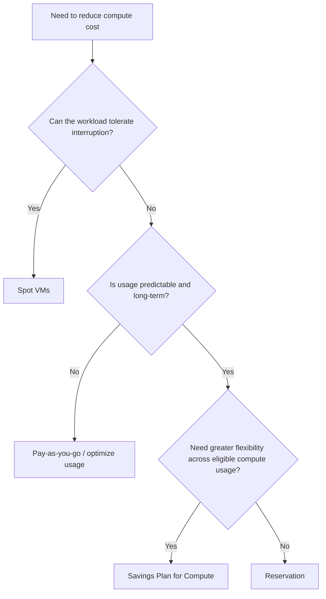

# Cost Optimization

## Definition

Cost optimization means selecting an appropriate purchasing and resource strategy so Azure spending matches workload requirements.

The best option depends on factors such as:

- workload predictability;
- required flexibility;
- ability to tolerate interruption;
- length and stability of expected usage.

---

## Cost Optimization Options

### Azure Reservations

Reservations can reduce cost for eligible resources when usage is **stable and predictable** and the organization can make a longer-term commitment.

Think:

> **Predictable long-term usage + less need for flexibility → Reservation**

### Azure Savings Plan for Compute

Azure savings plans for compute provide discounted eligible compute usage in exchange for a commitment to a consistent amount of compute spend over time.

Compared with a reservation, the key exam-level idea is **greater flexibility across eligible compute usage**.

Think:

> **Predictable compute spend + more flexibility → Savings Plan**

### Azure Spot Virtual Machines

Spot VMs use available Azure compute capacity at a discount, but the workload can be interrupted or evicted when Azure needs the capacity.

Think:

> **Interruptible workload → Spot VM**

Examples can include batch processing, testing, or other workloads that can tolerate interruption.

### Pay-As-You-Go

Pay-as-you-go provides flexibility without a long-term usage commitment.

It can be appropriate when usage is uncertain or highly variable and interruption is not acceptable.

---

## Decision Factors



Do not automatically choose the option with the largest possible discount. Choose the option that satisfies the workload requirements.

---

## Compare the Options

| Option | Best Fit | Key Trade-off |
|---|---|---|
| **Pay-as-you-go** | Uncertain or variable usage | Highest flexibility, no long-term commitment |
| **Reservation** | Stable, predictable long-term usage | Commitment for lower cost |
| **Savings Plan for Compute** | Predictable compute spend needing more flexibility | Spend commitment |
| **Spot VMs** | Interruptible workloads | Can be evicted/interrupted |

---

## Azure Advisor and Cost Optimization

Purchasing options are not the only way to reduce cost.

Azure Advisor can provide optimization recommendations, such as identifying underutilized resources that could be resized or shut down.

```text
Analyze actual spending
→ Microsoft Cost Management

Recommend how to improve resource cost efficiency
→ Azure Advisor
```

---

## Common Mistakes

### Choosing Spot Only Because It Is Cheaper

If the workload cannot tolerate interruption, Spot VMs are not the best fit.

### Choosing a Commitment for Unpredictable Usage

Reservations and savings plans are most useful when the relevant usage or spend is sufficiently predictable.

### Confusing Analysis With Recommendations

Cost Management analyzes spending; Azure Advisor recommends improvements.

---

## Exam Reasoning

Use this order:

```text
1. Can the workload be interrupted?
   → Yes: consider Spot

2. Is usage predictable and long-term?
   → Yes: consider commitment-based savings

3. Is greater eligible compute flexibility important?
   → Savings Plan

4. Is the workload stable and suited to a reservation?
   → Reservation

5. Is usage uncertain?
   → Pay-as-you-go may be the better fit
```

> **Workload requirements first; discount second.**
