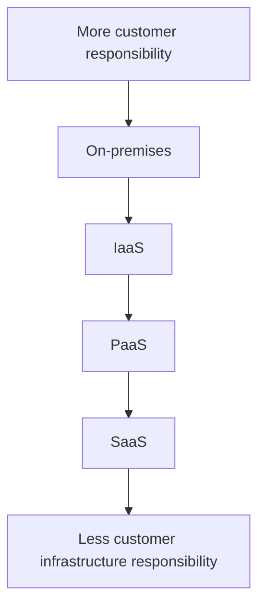

# Shared Responsibility Model

## Definition

The Shared Responsibility Model defines how security and management responsibilities are divided between the cloud provider and the customer.

The division of responsibility changes depending on the cloud service model:

- IaaS
- PaaS
- SaaS

As more responsibility is transferred to the cloud provider, the customer's infrastructure management responsibility decreases.

## The Core Principle

Moving to the cloud does not transfer every responsibility to Microsoft.

Some responsibilities move from the customer to Microsoft depending on the service model, while others remain with the customer.

The general pattern is:

## On-Premises

In a traditional on-premises environment, the organization is responsible for managing the entire technology stack.

This includes:

- Physical datacenter
- Physical networking
- Physical servers
- Operating systems
- Applications
- Data

This provides maximum control but also maximum management responsibility.

## IaaS

With Infrastructure as a Service, Microsoft manages the physical infrastructure and virtualization layer.

The customer continues to manage areas such as:

- Operating system
- Applications
- Application configuration
- Data

Example:

> Azure Virtual Machines

## PaaS

With Platform as a Service, Microsoft also manages the operating system and platform.

The customer focuses primarily on:

- Application code
- Application configuration
- Data

Example:

> Azure App Service

## SaaS

With Software as a Service, Microsoft manages the infrastructure, platform, and application.

The customer primarily focuses on:

- Users
- Access
- Configuration
- Data

Example:

> Microsoft 365

## Responsibility Comparison

| Responsibility | On-Premises | IaaS | PaaS | SaaS |
|----------------|:-----------:|:----:|:----:|:----:|
| Customer data | Customer | Customer | Customer | Customer |
| Configurations and settings | Customer | Customer | Customer | Customer |
| Identities and users | Customer | Customer | Customer | Customer |
| Client devices | Customer | Customer | Customer | Shared |
| Applications | Customer | Customer | Shared | Shared |
| Network controls | Customer | Customer | Shared | Microsoft |
| Operating system | Customer | Customer | Microsoft | Microsoft |
| Physical hosts | Customer | Microsoft | Microsoft | Microsoft |
| Physical network | Customer | Microsoft | Microsoft | Microsoft |
| Physical datacenter | Customer | Microsoft | Microsoft | Microsoft |

## Responsibilities That Always Remain with the Customer

Regardless of the cloud service model, the customer always retains responsibility for important areas such as:

### Data

The customer is responsible for protecting and governing their data.

### Identities and Users

The customer manages user identities and accounts.

### Access Management

The customer determines who should have access and configures controls such as:

- Azure RBAC
- Multifactor Authentication
- Conditional Access

### Configurations and Settings

The customer remains responsible for configuring the cloud services they use appropriately.

The amount of infrastructure management decreases as you move from IaaS toward SaaS, but customer responsibility never becomes zero.

## Microsoft Trigger Words

If a question contains words such as:

- customer responsibility
- Microsoft responsibility
- operating system management
- shared responsibility
- cloud service model
- who manages

Think:

> Shared Responsibility Model

## Common Exam Questions

Microsoft may ask questions such as:

- Who manages the operating system in IaaS?
- Who manages the operating system in PaaS?
- Which service model gives the customer the most control?
- Which service model requires the least infrastructure management?
- Does the customer remain responsible for their data when using cloud services?

## Common Mistakes

❌ Thinking Microsoft manages everything when resources move to Azure.

Responsibilities depend on the service model.

❌ Thinking the customer manages the operating system in PaaS.

Microsoft manages the operating system in PaaS.

❌ Thinking SaaS removes all customer responsibility.

Customers still have responsibilities for their data, identities, access, and how the service is configured and used.

## Exam Tip

First identify the operating system boundary:

**Customer manages the OS**

→ **IaaS**

**Microsoft manages the OS**

→ **PaaS or SaaS**

Then ask:

**Customer deploys their own application**

→ **PaaS**

**Customer uses a ready-made application**

→ **SaaS**

Remember:

> **IaaS → PaaS → SaaS**

As you move to the right:

> **Customer infrastructure responsibility decreases.**

But the customer always retains important responsibilities for:

- Data
- Identities
- Access
- Configuration