# Azure Fundamentals Concept Map

> High-level map of the core concepts and services covered in AZ-900.

Use this page to understand how the major Azure concepts relate to each other.

## Cloud Fundamentals

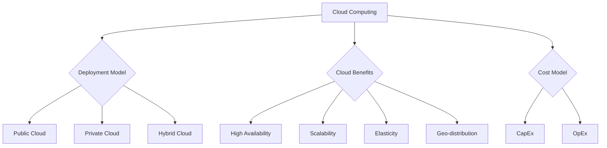

### Cloud Benefits

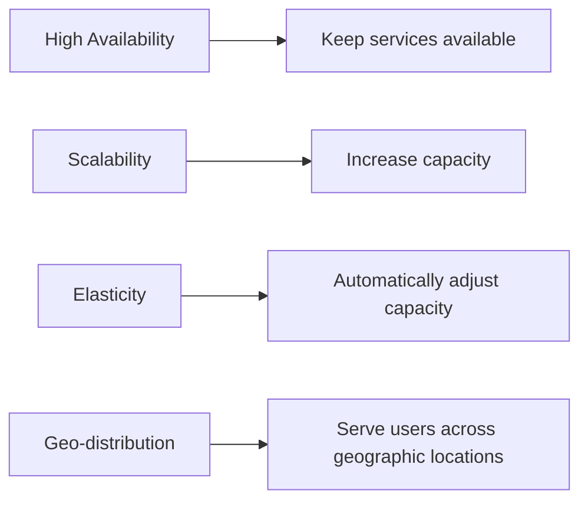

## Azure Resource Hierarchy

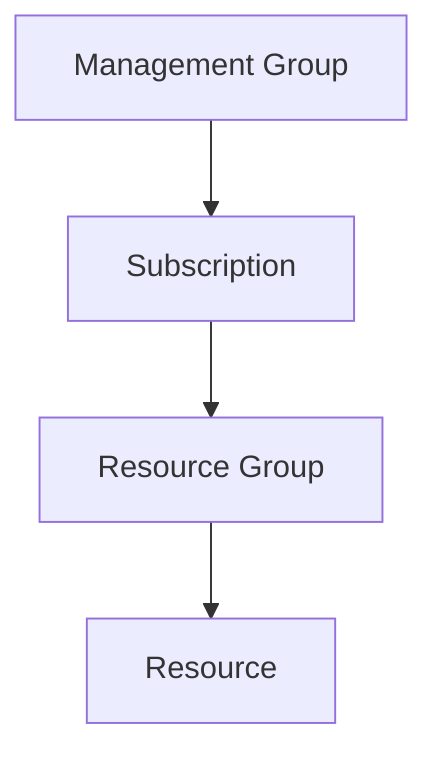

### Responsibility of Each Level

| Level | Main Purpose |
|---|---|
| Management Group | Organize multiple subscriptions |
| Subscription | Billing, quotas, and governance boundary |
| Resource Group | Organize related resources |
| Resource | Actual Azure service instance |

Azure Resource Manager provides the management layer used to create, update, and delete Azure resources.

## Azure Global Infrastructure

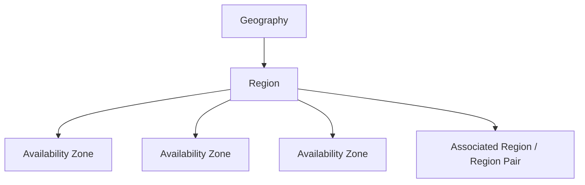

### Infrastructure Concepts

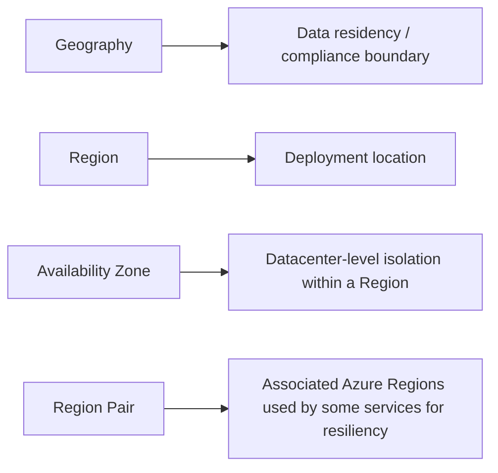

Not every Azure Region has a Region Pair.

## Compute

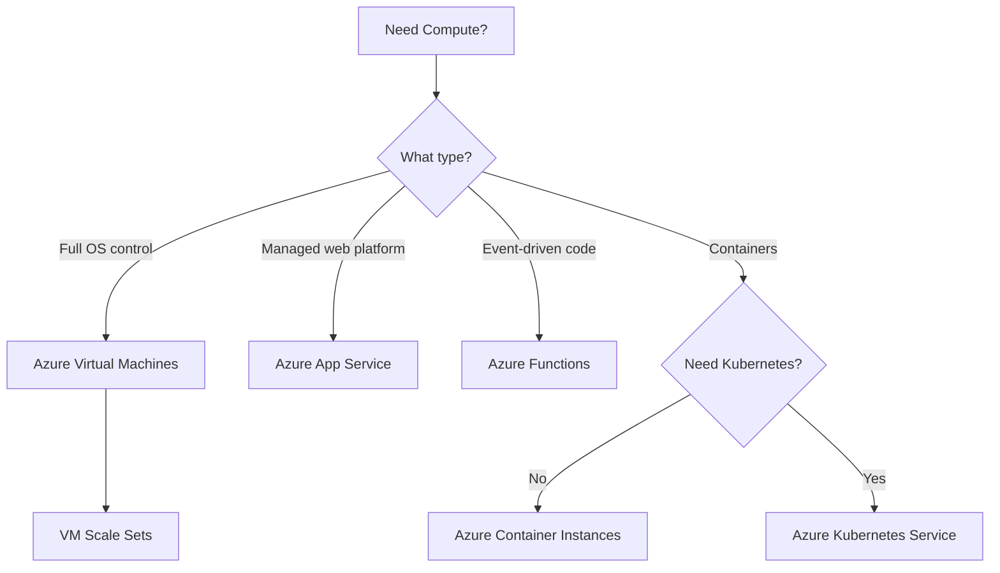

### Compute Selection

| Requirement | Service |
|---|---|
| OS control | Azure Virtual Machines |
| Scalable group of VMs | VM Scale Sets |
| Managed web application platform | Azure App Service |
| Event-driven serverless code | Azure Functions |
| Simple container execution | Azure Container Instances |
| Kubernetes orchestration | Azure Kubernetes Service |

## Networking

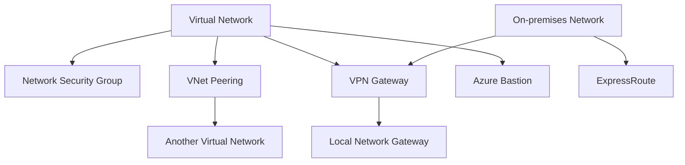

### Networking Concepts

| Requirement | Service |
|---|---|
| Private Azure network | Virtual Network |
| Filter network traffic | Network Security Group |
| Connect Azure VNets | VNet Peering |
| Encrypted VPN connectivity | VPN Gateway |
| Private connectivity without traversing the public Internet | ExpressRoute |
| Secure RDP / SSH to VMs | Azure Bastion |
| Represent remote or on-premises VPN site | Local Network Gateway |

## Storage

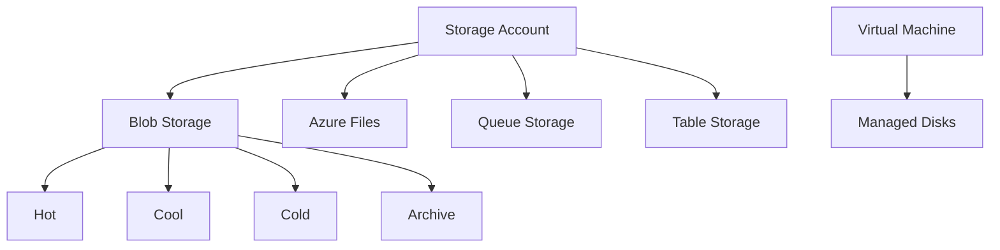

### Storage Selection

| Data Requirement | Service |
|---|---|
| Objects / unstructured data | Blob Storage |
| Shared file system | Azure Files |
| VM block storage | Managed Disks |
| Messages | Queue Storage |
| NoSQL key/attribute data | Table Storage |

### Blob Access Tiers

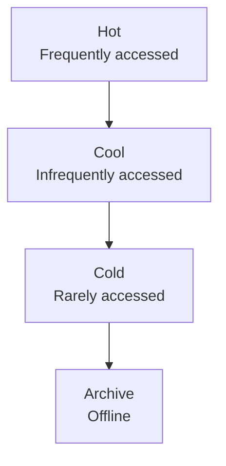

Hot, Cool, and Cold are online tiers.

Archive is an offline tier and requires rehydration before the data can be accessed.

## Identity and Access

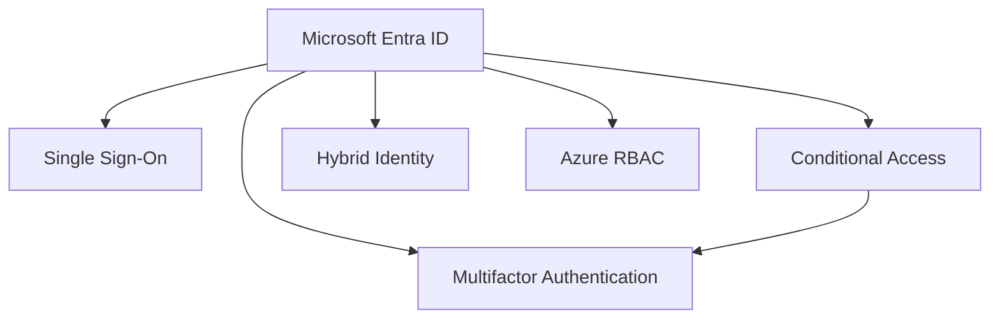

### Identity Concepts

| Requirement | Service / Concept |
|---|---|
| Identity and authentication | Microsoft Entra ID |
| Authorization to Azure resources | Azure RBAC |
| Additional identity verification | MFA |
| Decide when access controls apply | Conditional Access |
| One sign-in for multiple applications | SSO |
| Common identity across on-premises and cloud | Hybrid Identity |

### Authentication vs Authorization

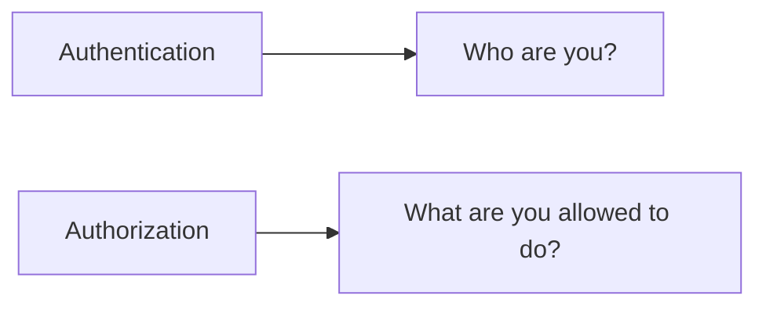

## Governance

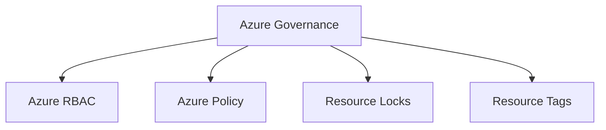

### Governance Selection

| Requirement | Think |
|---|---|
| Who can perform actions? | Azure RBAC |
| What configurations are allowed? | Azure Policy |
| Prevent accidental deletion or modification? | Resource Locks |
| Organize and classify resources? | Resource Tags |

### Governance Mental Model

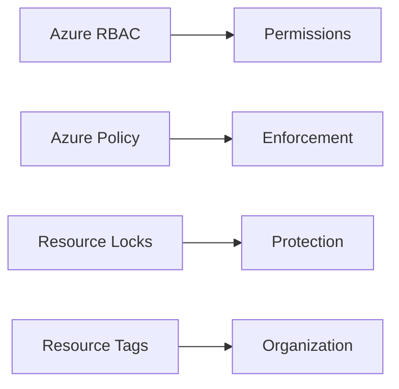

## Monitoring and Observability

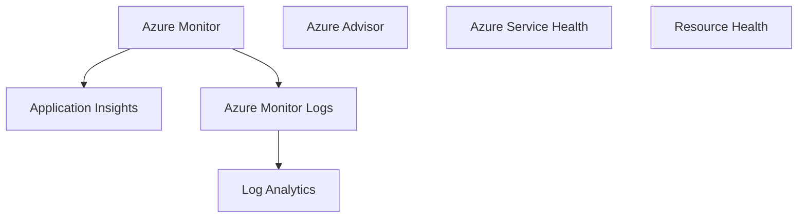

### Monitoring Selection

| Requirement | Service |
|---|---|
| Overall observability | Azure Monitor |
| Application performance | Application Insights |
| Query and analyze logs | Log Analytics |
| Optimization recommendations | Azure Advisor |
| Azure platform incidents and maintenance | Azure Service Health |
| Health of one Azure resource | Resource Health |

### Monitoring Mental Model

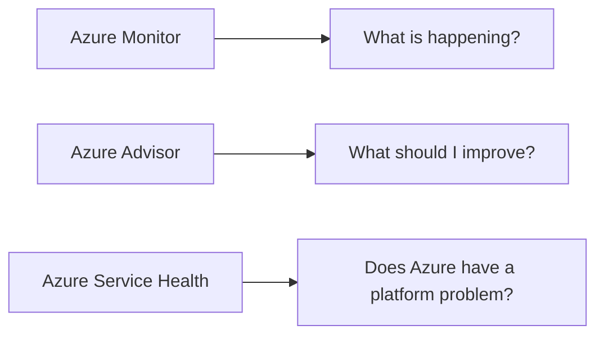

## Cost Management

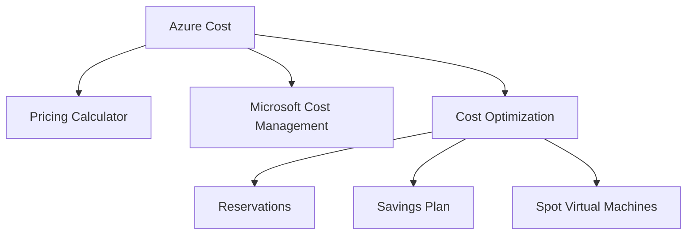

### Cost Selection

| Requirement | Think |
|---|---|
| Estimate future cost | Azure Pricing Calculator |
| Analyze actual spending | Microsoft Cost Management |
| Stable predictable usage | Azure Reservations |
| Flexible compute commitment | Azure Savings Plan |
| Interruptible workload | Azure Spot Virtual Machines |

## Cloud Service Models

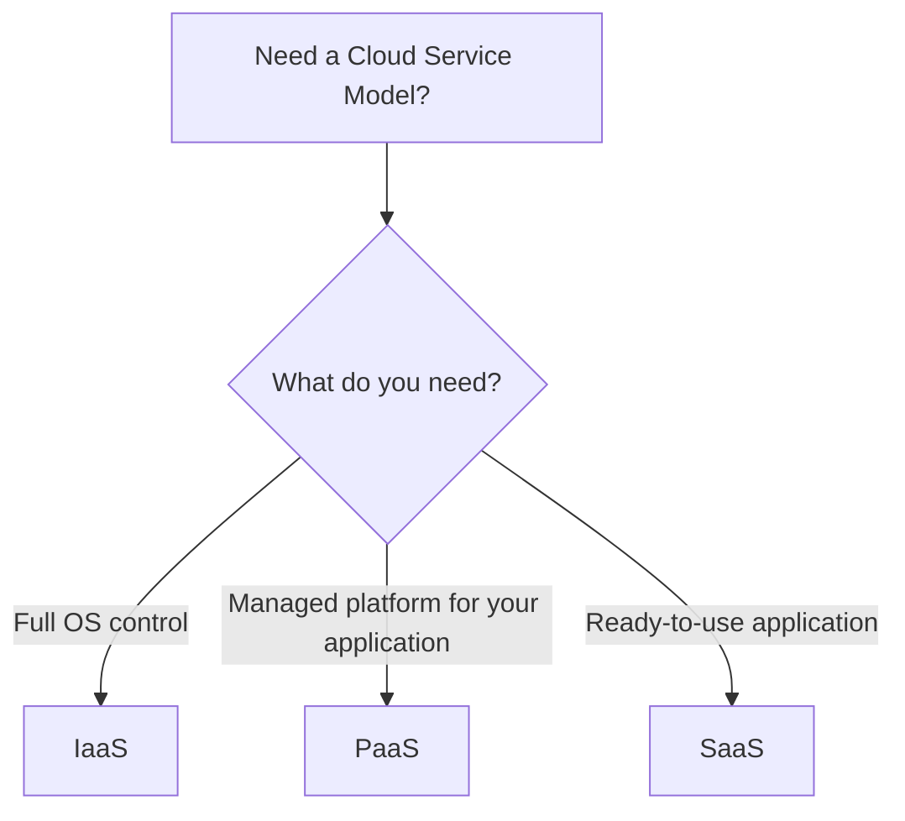

### Service Model Selection

| Model | Example | Key Idea |
|---|---|---|
| IaaS | Azure Virtual Machines | Customer manages the OS |
| PaaS | Azure App Service | Microsoft manages the OS and platform |
| SaaS | Microsoft 365 | Customer uses a ready-to-use application |

## Shared Responsibility

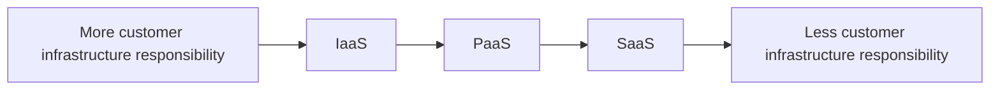

As you move from IaaS to PaaS to SaaS, customer infrastructure management responsibility decreases.

Customer responsibility never becomes zero.

### Customer Responsibilities

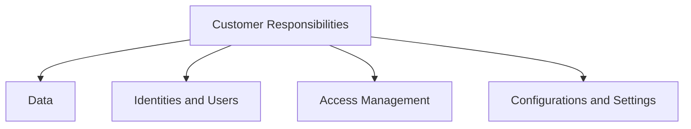

These responsibilities remain important regardless of the cloud service model.

## AZ-900 Big Picture

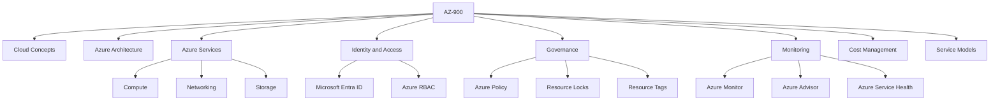

## Final Mental Model

```mermaid
flowchart TD

    A["What does the scenario need?"]

    A -->|Identity / Authentication| ENTRA["Microsoft Entra ID"]

    A -->|Azure resource permissions| RBAC["Azure RBAC"]

    A -->|Governance enforcement| POLICY["Azure Policy"]

    A -->|Prevent deletion or modification| LOCKS["Resource Locks"]

    A -->|OS-level compute control| VM["Azure Virtual Machines"]

    A -->|Managed web application platform| APP["Azure App Service"]

    A -->|Event-driven code| FUNC["Azure Functions"]

    A -->|Kubernetes orchestration| AKS["Azure Kubernetes Service"]

    A -->|Private Azure network| VNET["Virtual Network"]

    A -->|Filter network traffic| NSG["Network Security Group"]

    A -->|Private on-premises connectivity| ER["ExpressRoute"]

    A -->|Object storage| BLOB["Blob Storage"]

    A -->|Shared files| FILES["Azure Files"]

    A -->|Monitoring / Telemetry| MON["Azure Monitor"]

    A -->|Optimization recommendations| ADV["Azure Advisor"]

    A -->|Azure platform incidents| SH["Azure Service Health"]

    A -->|Estimate future cost| PC["Azure Pricing Calculator"]

    A -->|Analyze actual spending| CM["Microsoft Cost Management"]
```

## Exam Strategy

Do not start with:

> "Which Azure service name do I recognize?"

Start with:

> **"What problem is the scenario trying to solve?"**

Then follow this pattern:

```mermaid
flowchart LR

    R["Requirement"] --> C["Concept"]

    C --> S["Azure Service"]
```

Use the requirement to identify the concept first.

Then map the concept to the correct Azure service.