# Azure Fundamentals Concept Map

> High-level map of the core concepts and services covered in AZ-900.

Use this page to understand **how the major concepts relate to each other**. For detailed explanations, use the chapter files; for scenario selection, use the decision trees.

## 1. Cloud Fundamentals

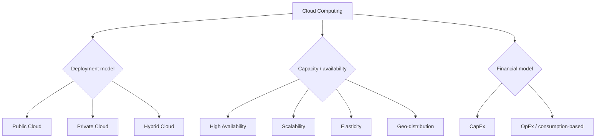
```mermaid
flowchart TD
    A["Cloud Computing"] --> B{"Deployment model"}
    B --> PUB["Public Cloud"]
    B --> PRI["Private Cloud"]
    B --> HYB["Hybrid Cloud"]

    A --> C{"Capacity / availability"}
    C --> HA["High Availability"]
    C --> SC["Scalability"]
    C --> EL["Elasticity"]
    C --> GEO["Geo-distribution"]

    A --> D{"Financial model"}
    D --> CAPEX["CapEx"]
    D --> OPEX["OpEx / consumption-based"]
```

### High-Value Distinctions

| Requirement | Think |
|---|---|
| Shared cloud-provider infrastructure | **Public Cloud** |
| Environment dedicated to one organization | **Private Cloud** |
| On-premises/private + public cloud | **Hybrid Cloud** |
| Capacity can increase or decrease | **Scalability** |
| Capacity dynamically follows demand | **Elasticity** |
| More CPU/RAM on one resource | **Vertical scaling — Up/Down** |
| More/fewer instances | **Horizontal scaling — Out/In** |
| Upfront infrastructure investment | **CapEx** |
| Pay for consumption over time | **OpEx** |

Serverless services such as **Azure Functions** let you run code without managing servers and commonly use consumption-based execution.

## 2. Azure Global Infrastructure

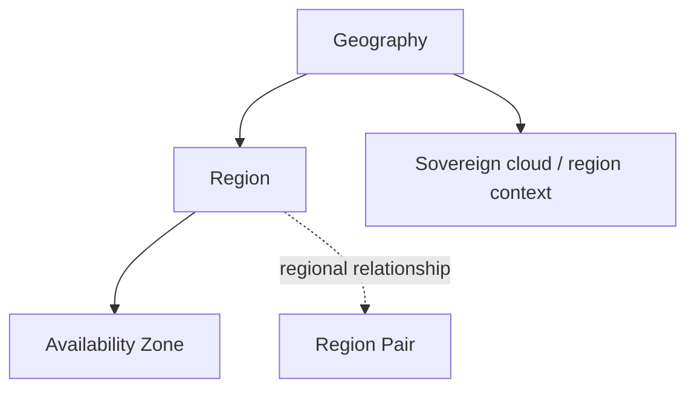
```mermaid
flowchart TD
    GEO["Geography"] --> REG["Region"]
    REG --> AZ1["Availability Zone"]
    REG -. "regional relationship" .-> RP["Region Pair"]
    GEO --> SOV["Sovereign cloud / region context"]
```

| Concept | Main Idea |
|---|---|
| **Geography** | Broad geographic / data-residency boundary |
| **Region** | Geographic Azure deployment location |
| **Availability Zone** | Physically separate datacenter location within a region |
| **Region Pair** | Relationship between two Azure regions used by some services for resiliency |
| **Sovereign cloud/region** | Isolated environment for specific governmental or regulatory requirements |

> **Zone failure → think Availability Zones. Regional resiliency → think multi-region design; a Region Pair is a relationship between regions, not an automatic DR solution for every workload.**

## 3. Azure Resource Hierarchy and Management

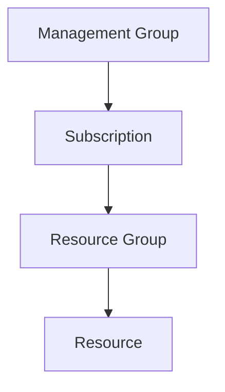
```mermaid
flowchart TD
    MG["Management Group"] --> SUB["Subscription"]
    SUB --> RG["Resource Group"]
    RG --> RES["Resource"]
```

| Level | Main Purpose |
|---|---|
| **Management Group** | Organize multiple subscriptions |
| **Subscription** | Billing, quotas, access/governance boundary |
| **Resource Group** | Logical container for related resources |
| **Resource** | Deployed Azure service instance |

Important Resource Group facts:

```text
Every resource belongs to one Resource Group.

A Resource Group can contain different resource types.

Resources in one Resource Group can be deployed in different Azure regions.
```

### Azure Resource Manager and IaC

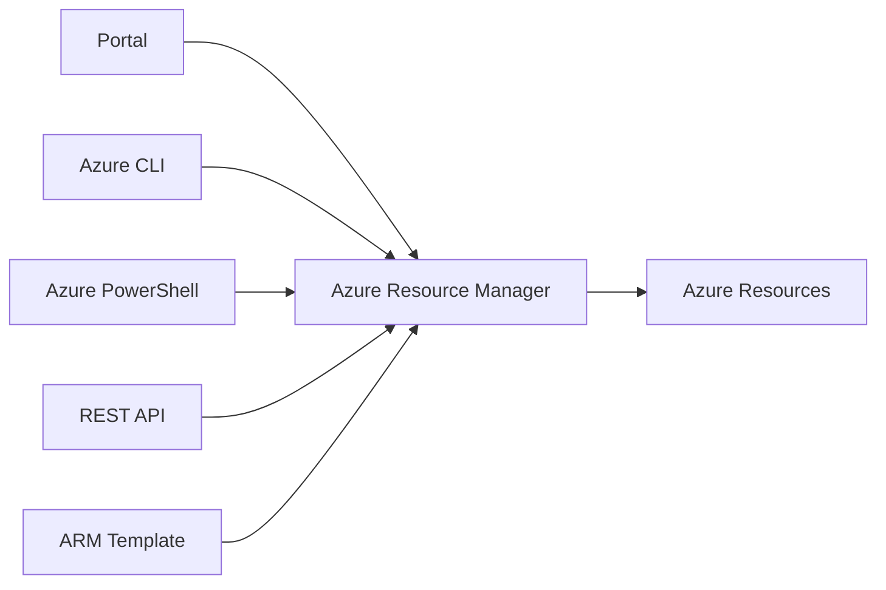
```mermaid
flowchart LR
    P["Portal"] --> ARM["Azure Resource Manager"]
    CLI["Azure CLI"] --> ARM
    PS["Azure PowerShell"] --> ARM
    API["REST API"] --> ARM
    TEMPLATE["ARM Template"] --> ARM
    ARM --> RES["Azure Resources"]
```

```text
ARM
→ Azure management and deployment layer

ARM Template
→ declarative JSON infrastructure definition
→ Infrastructure as Code
```

## 4. Compute

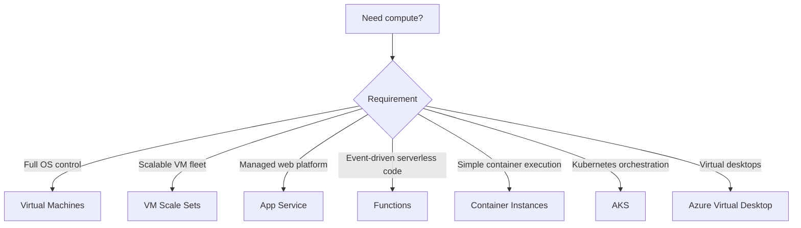
```mermaid
flowchart TD
    A["Need compute?"] --> B{"Requirement"}
    B -->|"Full OS control"| VM["Virtual Machines"]
    B -->|"Scalable VM fleet"| VMSS["VM Scale Sets"]
    B -->|"Managed web platform"| APP["App Service"]
    B -->|"Event-driven serverless code"| FUNC["Functions"]
    B -->|"Simple container execution"| ACI["Container Instances"]
    B -->|"Kubernetes orchestration"| AKS["AKS"]
    B -->|"Virtual desktops"| AVD["Azure Virtual Desktop"]
```

| Requirement | Best Fit |
|---|---|
| OS-level control | Azure Virtual Machines |
| Group of automatically scalable VMs | VM Scale Sets |
| Managed web/API hosting | App Service |
| Event-driven code | Azure Functions |
| Run containers without managing orchestration | Azure Container Instances |
| Kubernetes | Azure Kubernetes Service |
| Desktop/app virtualization | Azure Virtual Desktop |

## 5. Networking

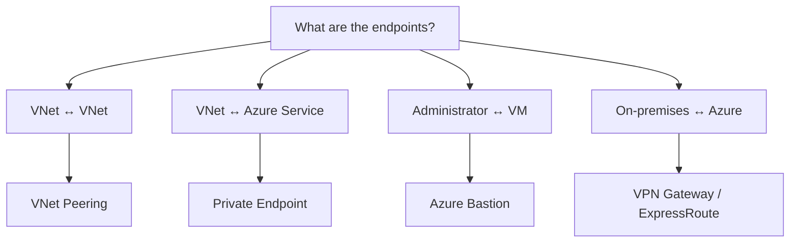
```mermaid
flowchart TD
    A["What are the endpoints?"]
    A --> VV["VNet ↔ VNet"]
    A --> VS["VNet ↔ Azure Service"]
    A --> VM["Administrator ↔ VM"]
    A --> OA["On-premises ↔ Azure"]
    VV --> PEER["VNet Peering"]
    VS --> PE["Private Endpoint"]
    VM --> BASTION["Azure Bastion"]
    OA --> CONN["VPN Gateway / ExpressRoute"]
```

| Requirement | Service |
|---|---|
| Private Azure network | Virtual Network |
| Divide a VNet | Subnet |
| Filter inbound/outbound traffic | Network Security Group |
| Connect VNets privately | VNet Peering |
| Private IP access to supported Azure service | Private Endpoint |
| Secure RDP/SSH without public IP on VM | Azure Bastion |
| Name resolution | Azure DNS |
| Encrypted Internet-based on-prem connectivity | VPN Gateway |
| Private connectivity that avoids public Internet | ExpressRoute |

> **Private** is not enough to choose a service. Identify the two endpoints first.

## 6. Storage

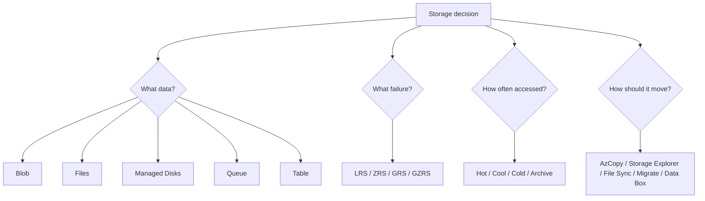
```mermaid
flowchart TD
    A["Storage decision"] --> DATA{"What data?"}
    A --> FAIL{"What failure?"}
    A --> ACCESS{"How often accessed?"}
    A --> MOVE{"How should it move?"}

    DATA --> BLOB["Blob"]
    DATA --> FILES["Files"]
    DATA --> DISK["Managed Disks"]
    DATA --> QUEUE["Queue"]
    DATA --> TABLE["Table"]

    FAIL --> RED["LRS / ZRS / GRS / GZRS"]
    ACCESS --> TIER["Hot / Cool / Cold / Archive"]
    MOVE --> TOOLS["AzCopy / Storage Explorer / File Sync / Migrate / Data Box"]
```

### Storage Service Selection

| Requirement | Service |
|---|---|
| Objects / unstructured data | Blob Storage |
| Shared SMB/NFS files | Azure Files |
| VM block storage | Managed Disks |
| Asynchronous messages | Queue Storage |
| NoSQL key/attribute data | Table Storage |

### Redundancy

```text
Local failure → LRS
Zone failure → ZRS
Regional replication → GRS
Zone + regional resiliency → GZRS
```

### Blob Access Tiers

```text
Frequent → Hot
Infrequent + online → Cool
Rare + online → Cold
Long-term + offline acceptable → Archive
```

Archive requires **rehydration** before normal access.

### Movement vs Migration

```text
CLI copy → AzCopy
GUI management/copy → Storage Explorer
Windows file-server synchronization → Azure File Sync
Discover / assess / plan migration → Azure Migrate
Very large transfer when network is impractical → Azure Data Box
```

## 7. Identity, Authentication, and Security

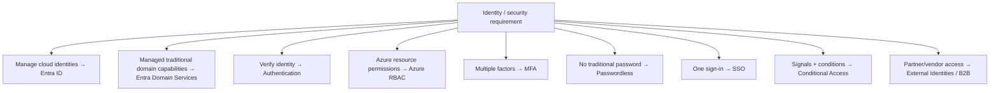
```mermaid
flowchart TD
    A["Identity / security requirement"]
    A --> ID["Manage cloud identities → Entra ID"]
    A --> DS["Managed traditional domain capabilities → Entra Domain Services"]
    A --> AUTH["Verify identity → Authentication"]
    A --> RBAC["Azure resource permissions → Azure RBAC"]
    A --> MFA["Multiple factors → MFA"]
    A --> PASS["No traditional password → Passwordless"]
    A --> SSO["One sign-in → SSO"]
    A --> CA["Signals + conditions → Conditional Access"]
    A --> EXT["Partner/vendor access → External Identities / B2B"]
```

### Core Identity Distinctions

```text
WHO ARE YOU?
→ Authentication

WHAT CAN YOU DO?
→ Authorization / RBAC

Same identity across on-premises + cloud
→ Hybrid Identity

One authentication for multiple apps
→ SSO
```

### RBAC Mental Model

```text
WHO + ROLE + SCOPE
→ ACCESS
```

```text
Reader → view
Contributor → manage resources, NOT role assignments
Owner → manage resources + access
User Access Administrator / RBAC Administrator → manage access
```

Who created an existing role assignment is usually not the deciding factor; **permission + scope** determine who can manage it.

### Security Fundamentals

| Concept | Main Idea |
|---|---|
| **Zero Trust** | Verify explicitly, use least privilege, assume breach |
| **Defense in Depth** | Multiple security layers |
| **Microsoft Defender for Cloud** | Cloud security posture, recommendations, and protection |

---

## 8. Governance and Management Tools

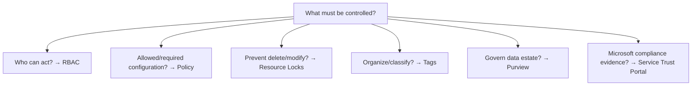
```mermaid
flowchart TD
    A["What must be controlled?"]
    A --> WHO["Who can act? → RBAC"]
    A --> CONF["Allowed/required configuration? → Policy"]
    A --> PROT["Prevent delete/modify? → Resource Locks"]
    A --> META["Organize/classify? → Tags"]
    A --> DATA["Govern data estate? → Purview"]
    A --> DOC["Microsoft compliance evidence? → Service Trust Portal"]
```

### Governance Distinctions

```text
Permissions → RBAC
Configuration enforcement → Azure Policy
Resource protection → Resource Locks
Metadata / categorization → Tags
```

```text
CanNotDelete → modify YES, delete NO
ReadOnly → modify NO, delete NO
```

Tags are **not automatically inherited** from a Resource Group to its resources.

### Azure Management Tools

| Requirement | Tool |
|---|---|
| Graphical browser management | Azure Portal |
| Browser-hosted command environment | Cloud Shell |
| Cross-platform command-line management | Azure CLI |
| PowerShell-based administration | Azure PowerShell |
| Manage hybrid / multicloud resources through Azure | Azure Arc |
| Define infrastructure declaratively | Infrastructure as Code |
| Azure declarative JSON deployment | ARM Template |

> **Cloud Shell is an environment; Azure CLI and Azure PowerShell are tools that can run inside it.**

## 9. Monitoring and Optimization

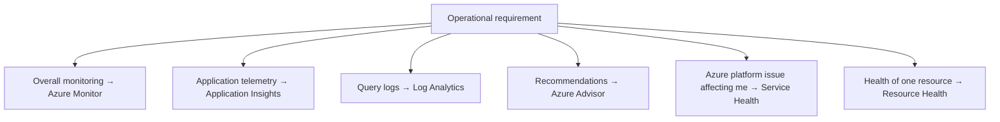
```mermaid
flowchart TD
    A["Operational requirement"]
    A --> MON["Overall monitoring → Azure Monitor"]
    A --> AI["Application telemetry → Application Insights"]
    A --> LOG["Query logs → Log Analytics"]
    A --> ADV["Recommendations → Azure Advisor"]
    A --> SH["Azure platform issue affecting me → Service Health"]
    A --> RH["Health of one resource → Resource Health"]
```

```text
Azure Monitor → What is happening?
Azure Advisor → What should I improve?
Service Health → Is Azure having a platform/service issue affecting me?
Resource Health → What is the health of this specific resource?
```

## 10. Cost Management

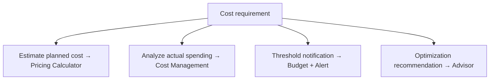
```mermaid
flowchart TD
    A["Cost requirement"]
    A --> PLAN["Estimate planned cost → Pricing Calculator"]
    A --> ACTUAL["Analyze actual spending → Cost Management"]
    A --> BUD["Threshold notification → Budget + Alert"]
    A --> OPT["Optimization recommendation → Advisor"]
```

### Purchasing / Optimization Choices

```text
Interruptible workload
→ Spot VMs

Stable predictable long-term usage
→ Reservations

Predictable compute spend + more flexibility
→ Savings Plan for Compute

Uncertain usage / no commitment
→ Pay-as-you-go
```

> A budget is a threshold/monitoring mechanism, **not a hard spending limit that automatically stops resources**.

## 11. Cloud Service Models and Shared Responsibility

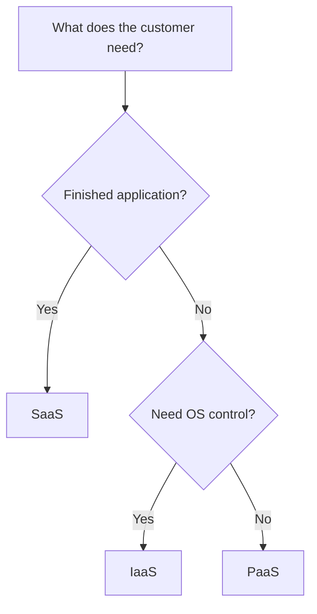
```mermaid
flowchart TD
    A["What does the customer need?"] --> B{"Finished application?"}
    B -->|Yes| SAAS["SaaS"]
    B -->|No| C{"Need OS control?"}
    C -->|Yes| IAAS["IaaS"]
    C -->|No| PAAS["PaaS"]
```

| Example | Model |
|---|---|
| Azure Virtual Machines | **IaaS** |
| Azure App Service | **PaaS** |
| Azure Functions | **PaaS** |
| Azure SQL Database | **PaaS** |
| Microsoft 365 | **SaaS** |

### Shared Responsibility

```text
MORE CUSTOMER INFRASTRUCTURE RESPONSIBILITY

On-premises
    ↓
IaaS
    ↓
PaaS
    ↓
SaaS

LESS CUSTOMER INFRASTRUCTURE RESPONSIBILITY
```

```text
Guest OS in IaaS → Customer
OS in PaaS/SaaS → Provider
Application in PaaS → Customer
Application/platform in SaaS → Provider
```

Customer responsibility does **not** become zero in SaaS; responsibilities around data, identities, access, and endpoints remain.

## AZ-900 Big Picture

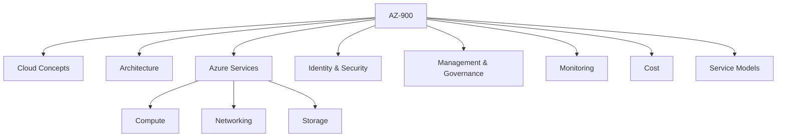
```mermaid
flowchart TD
    AZ["AZ-900"]
    AZ --> CLOUD["Cloud Concepts"]
    AZ --> ARCH["Architecture"]
    AZ --> SERVICES["Azure Services"]
    AZ --> ID["Identity & Security"]
    AZ --> GOV["Management & Governance"]
    AZ --> MON["Monitoring"]
    AZ --> COST["Cost"]
    AZ --> MODELS["Service Models"]

    SERVICES --> COMPUTE["Compute"]
    SERVICES --> NETWORK["Networking"]
    SERVICES --> STORAGE["Storage"]
```
