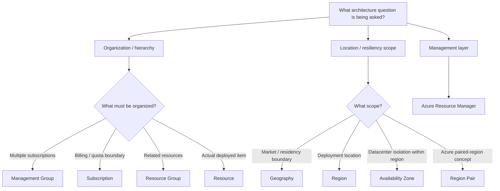

# Azure Architecture Decision Tree

Start by identifying whether the question is about **organization, location/failure scope, or resource management**.



## Resource Hierarchy

```text
Management Group
      ↓
Subscription
      ↓
Resource Group
      ↓
Resource
```

## High-Value Distinctions

```text
Organize subscriptions
→ Management Group

Billing / quota / resource boundary
→ Subscription

Logical resource container
→ Resource Group

Actual deployed instance
→ Resource

Geographic deployment location
→ Region

Datacenter isolation within a region
→ Availability Zone

Relationship between two Azure regions
→ Region Pair

Deployment and management layer
→ Azure Resource Manager
```

## Common Architecture Traps

```text
Resource Group location
≠ all resources must be in that region

Availability Zone
≠ separate Azure region

Regional DR requirement
≠ automatically "Region Pair" for every architecture
```

## Final Decision Rule
Identify **what is being organized**, **the geographic/failure scope**, or **whether the question is about Azure's management layer**.
