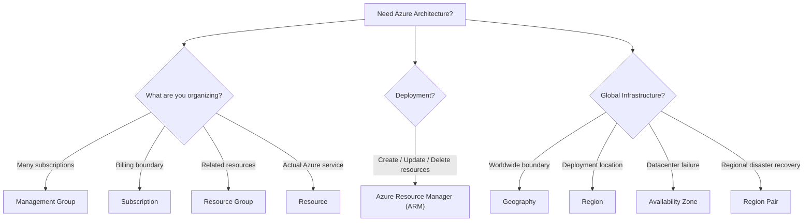

# Azure Architecture Decision Tree

```mermaid
flowchart TD

    A["Need Azure Architecture?"] --> B{"What are you organizing?"}

    B -->|Many subscriptions| C["Management Group"]

    B -->|Billing boundary| D["Subscription"]

    B -->|Related resources| E["Resource Group"]

    B -->|Actual Azure service| F["Resource"]

    A --> G{"Deployment?"}

    G -->|Create / Update / Delete resources| H["Azure Resource Manager (ARM)"]

    A --> I{"Global Infrastructure?"}

    I -->|Worldwide boundary| J["Geography"]

    I -->|Deployment location| K["Region"]

    I -->|Datacenter failure| L["Availability Zone"]

    I -->|Regional disaster recovery| M["Region Pair"]
```