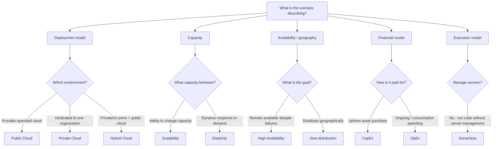

# Cloud Concepts Decision Tree

Start with **what type of cloud concept the scenario is testing**, not a trigger word.



## High-Value Distinctions

```text
Public / Private / Hybrid
→ deployment model

Scalability
→ capacity CAN change

Elasticity
→ capacity dynamically follows demand

High Availability
→ reduce downtime / survive failures

Geo-distribution
→ geographic placement

CapEx
→ upfront investment

OpEx
→ ongoing / consumption-based spending

Serverless
→ run code without managing servers
```

## Final Decision Rule

```text
1. Identify the category: deployment, capacity, availability/geography, or finance.
2. Identify the actual requirement.
3. Choose the concept that directly describes that requirement.
```
