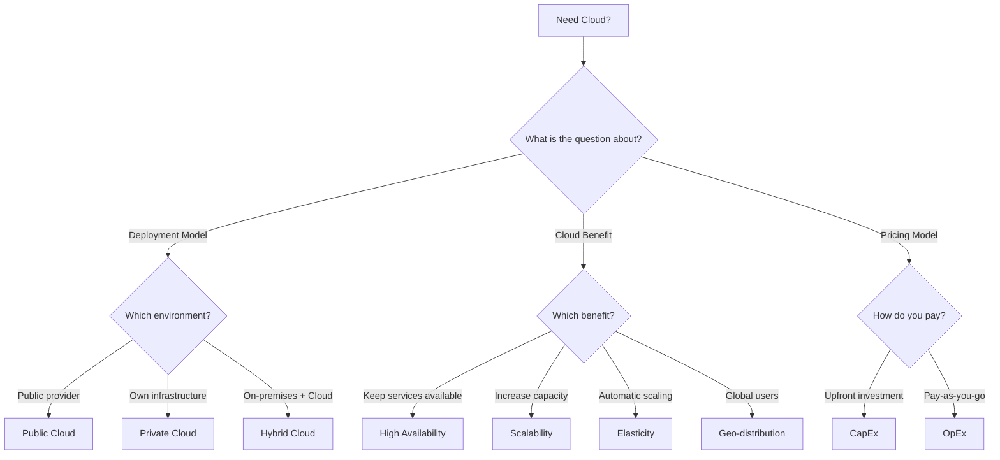

# Cloud Decision Tree

```mermaid
flowchart TD

    A["Need Cloud?"] --> B{"What is the question about?"}

    B -->|Deployment Model| C{"Which environment?"}

    C -->|Public provider| D["Public Cloud"]
    C -->|Own infrastructure| E["Private Cloud"]
    C -->|On-premises + Cloud| F["Hybrid Cloud"]

    B -->|Cloud Benefit| G{"Which benefit?"}

    G -->|Keep services available| H["High Availability"]
    G -->|Increase capacity| I["Scalability"]
    G -->|Automatic scaling| J["Elasticity"]
    G -->|Global users| K["Geo-distribution"]

    B -->|Pricing Model| L{"How do you pay?"}

    L -->|Upfront investment| M["CapEx"]
    L -->|Pay-as-you-go| N["OpEx"]
```