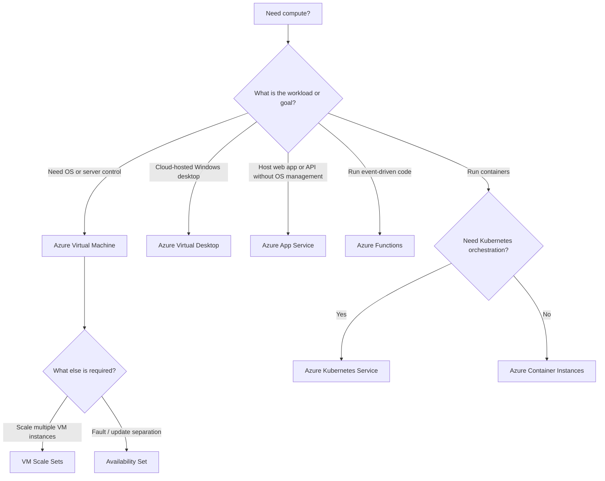

# Compute Decision Tree



## Key Distinctions

```text
Maximum OS control
→ Virtual Machine

Multiple VM instances + scaling
→ VM Scale Sets

VM fault/update separation
→ Availability Set

Physical datacenter isolation within a region
→ Availability Zone

Cloud-hosted Windows desktop for users
→ Azure Virtual Desktop

Managed web app / API hosting
→ App Service

Event-driven code
→ Azure Functions

Simple managed container execution
→ Azure Container Instances

Kubernetes orchestration
→ Azure Kubernetes Service
```

> **Exam rule:** Identify the workload first, then compare control, administrative effort, scaling, and availability requirements.
