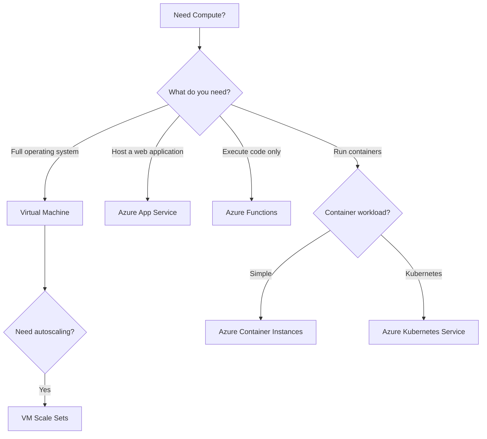

# Compute Decision Tree

```mermaid
flowchart TD

    A["Need Compute?"] --> B{"What do you need?"}

    B -->|Full operating system| C["Virtual Machine"]

    C --> D{"Need autoscaling?"}

    D -->|Yes| E["VM Scale Sets"]

    B -->|Host a web application| F["Azure App Service"]

    B -->|Execute code only| G["Azure Functions"]

    B -->|Run containers| H{"Container workload?"}

    H -->|Simple| I["Azure Container Instances"]

    H -->|Kubernetes| J["Azure Kubernetes Service"]
```