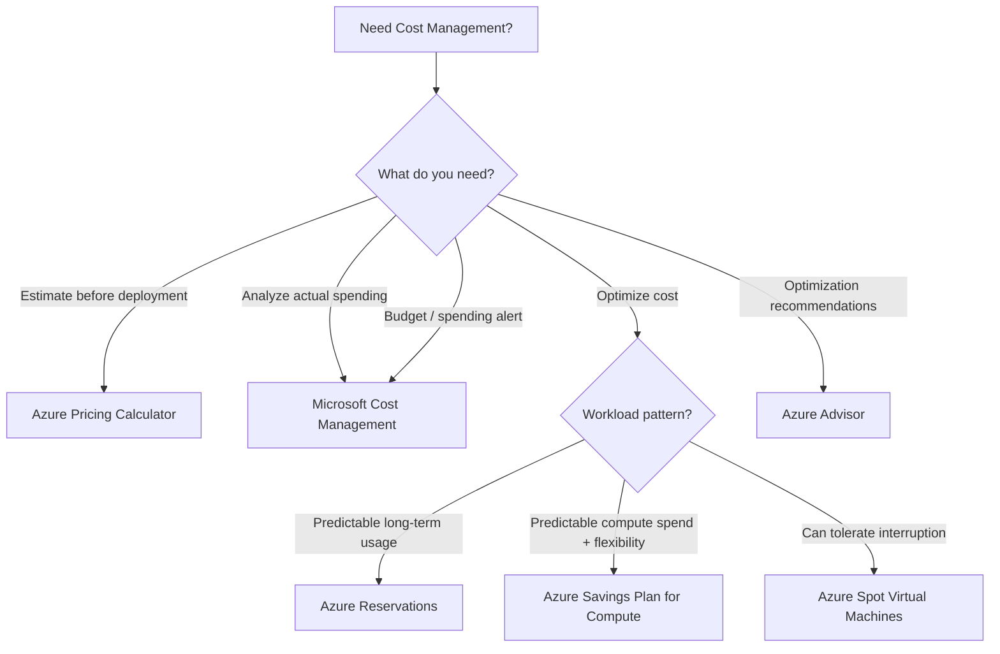

# Cost Decision Tree

```mermaid
flowchart TD

    A["Need Cost Management?"] --> B{"What do you need?"}

    B -->|Estimate before deployment| C["Azure Pricing Calculator"]

    B -->|Analyze actual spending| D["Microsoft Cost Management"]

    B -->|Budget / spending alert| D

    B -->|Optimize cost| E{"Workload pattern?"}

    E -->|Predictable long-term usage| F["Azure Reservations"]

    E -->|Predictable compute spend + flexibility| G["Azure Savings Plan for Compute"]

    E -->|Can tolerate interruption| H["Azure Spot Virtual Machines"]

    B -->|Optimization recommendations| I["Azure Advisor"]
```