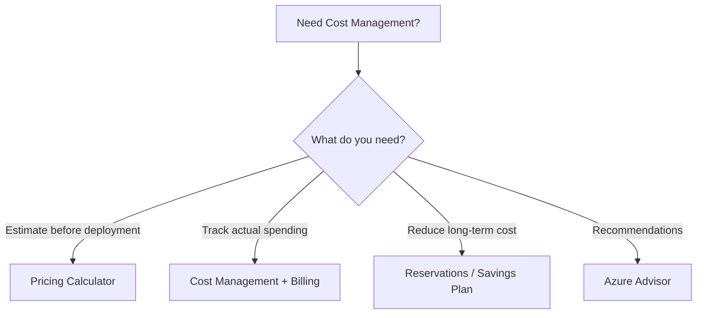

# Cost Decision Tree

```mermaid
flowchart TD

    A["Need Cost Management?"] --> B{"What do you need?"}

    B -->|Estimate before deployment| C["Pricing Calculator"]

    B -->|Track actual spending| D["Cost Management + Billing"]

    B -->|Reduce long-term cost| E["Reservations / Savings Plan"]

    B -->|Recommendations| F["Azure Advisor"]
```